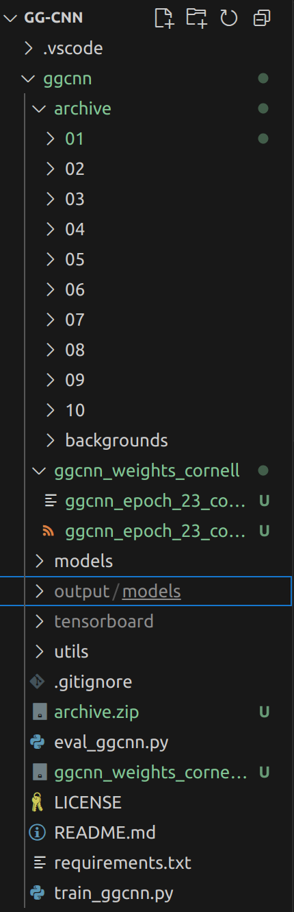
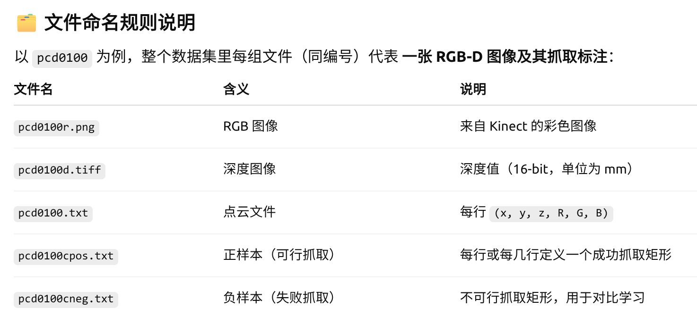
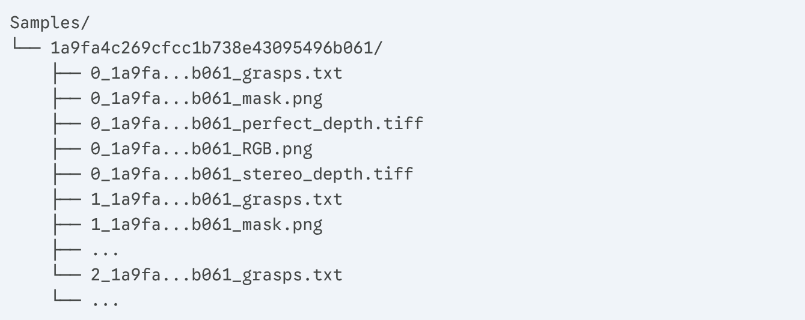
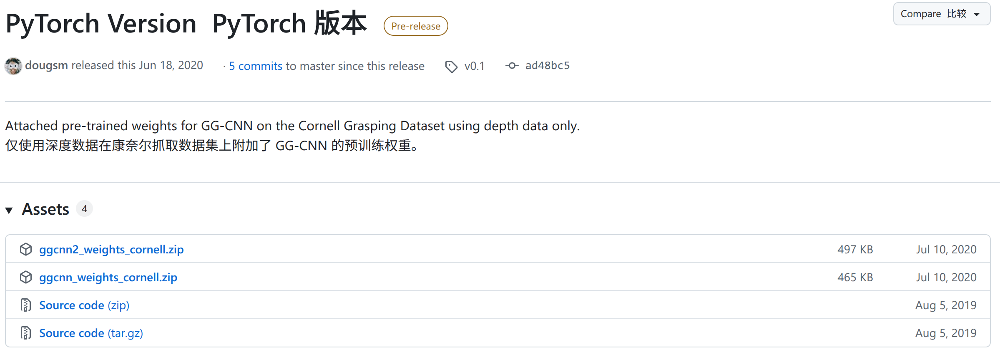
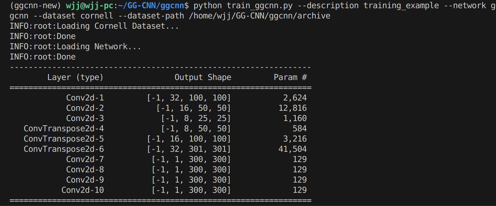
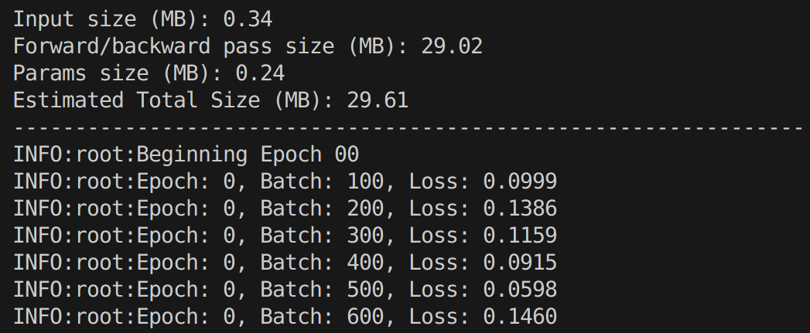
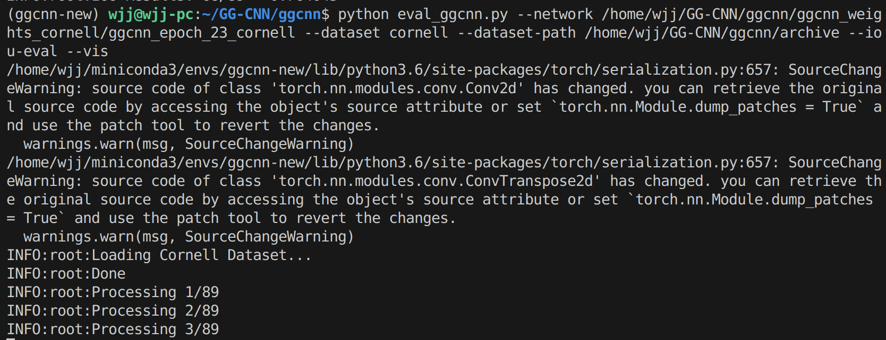

# GG-CNN

源码地址：https://github.com/dougsm/ggcnn?tab=readme-ov-file

别人复现：https://github.com/OneOneLiu/ggcnn_cornell_dataset

pytorch历史版本：https://pytorch.org/get-started/previous-versions/

其他相关链接：https://blog.csdn.net/gitblog_00476/article/details/141376980

复现文件目录如图所示：



## 1.下载数据集

### cornell数据集：

链接：https://pan.baidu.com/s/1lgPBUT4NPKYXNbzKgBIzCQ 
提取码：1n7s

或者去kaggle下载：https://www.kaggle.com/datasets/oneoneliu/cornell-grasp（推荐，速度快）

下载之后数据集格式如下所示：



康奈尔数据集标注的时候每四行数据是一个矩形框，并且默认第一行指向第二行的方向是抓取的开口方向，ggcnn就是这么读取数据的

###  **Jacquard**数据集：

官方链接：https://jacquard.liris.cnrs.fr/

只下载10个物体数据：



#### 1. 目录层级

- **`Samples/`**: 数据集的根目录。
- **`1a9fa...b061/` (场景ID)**: 这不是一个物体编号，而是一个**场景**的唯一哈希ID。这个文件夹包含了**同一个物体（或一组物体）在不同视角下的多张图像**。
- **`0_...`**, **`1_...`**, **`2_...` (视角ID)**: 在每个场景文件夹中，`0_`、`1_`、`2_` 等前缀代表了该场景的不同“快照”或“视角”。

#### 2. 文件命名与格式

对于**每一个视角**（例如 `0_...`），你都有一组完整的数据：

- **`..._RGB.png` - RGB 图像**
  - 标准的彩色图像。
- **`..._perfect_depth.tiff` - “完美”深度图**
  - 这是由**模拟器**生成的、没有噪声、没有孔洞的理想深度图。
- **`..._stereo_depth.tiff` - “立体”深度图**
  - 这是模拟的**立体相机**（如 RealSense）生成的深度图。它会包含噪声、黑洞和伪影，**更接近真实世界**。
  - 这使得 Jacquard 数据集非常强大：你可以在“完美”数据上训练，然后在“真实”数据上测试。
- **`..._mask.png` - 分割掩码**
  - 一个二值图像，其中白色像素代表物体，黑色像素代表背景。这可以用来精确地将物体从背景中分离出来。
- **`..._grasps.txt` - 抓取标注文件（核心区别！）**
  - 这是与 Cornell 数据集**最大的不同**。
  - 它不是用4个角点来定义矩形，而是使用一种**参数化**的格式。
  - 此 `_grasps.txt` 文件中的**每一行**都是一个**良好**的抓取，格式如下： `x;y;theta;w;h`
  - **`x`**: 抓取中心点的 **x** 坐标 (列)。
  - **`y`**: 抓取中心点的 **y** 坐标 (行)。
  - **`theta`**: 抓取矩形（夹爪）的**旋转角度**（通常是弧度或度）。
  - **`w`**: 抓取器的**开口宽度**（Grasper Width）。
  - **`h`**: 抓取矩形的**高度**（Grasper Height）。

## 2.配置环境

新建conda环境：

```bash
conda create -n ggcnn-new python=3.6
```

克隆源代码：

```
git clone https://github.com/dougsm/ggcnn.git
```

安装依赖项，需要修改官方提供的requirements文件，改成如下所示：

```
numpy==1.18.5

opencv-python==4.2.0.34

matplotlib==3.2.2

scikit-image==0.17.2

imageio==2.8.0

torch==1.5.1

torchvision==0.6.1

torchsummary

tensorboardX==2.0

imagecodecs==2020.5.30
```

```
cd ggcnn
pip install -r requirements.txt
```

## 3.下载预训练模型

下载地址：https://github.com/dougsm/ggcnn/releases/tag/v0.1



执行以下指令，检验权重、模型是否有效：

```python
# Enter the directory where you cloned this repo
cd /path/to/ggcnn

# Download the weights
wget https://github.com/dougsm/ggcnn/releases/download/v0.1/ggcnn_weights_cornell.zip

# Unzip the weights.
unzip ggcnn_weights_cornell.zip

# Load the weights in python, e.g.
python
>>> import torch

# Option 1) Load the model directly.
# (this may print warning based on the installed version of python)
>>> model = torch.load('ggcnn_weights_cornell/ggcnn_epoch_23_cornell')
>>> model

GGCNN(
  (conv1): Conv2d(1, 32, kernel_size=(9, 9), stride=(3, 3), padding=(3, 3))
  (conv2): Conv2d(32, 16, kernel_size=(5, 5), stride=(2, 2), padding=(2, 2))
  (conv3): Conv2d(16, 8, kernel_size=(3, 3), stride=(2, 2), padding=(1, 1))
  (convt1): ConvTranspose2d(8, 8, kernel_size=(3, 3), stride=(2, 2), padding=(1, 1), output_padding=(1, 1))
  (convt2): ConvTranspose2d(8, 16, kernel_size=(5, 5), stride=(2, 2), padding=(2, 2), output_padding=(1, 1))
  (convt3): ConvTranspose2d(16, 32, kernel_size=(9, 9), stride=(3, 3), padding=(3, 3), output_padding=(1, 1))
  (pos_output): Conv2d(32, 1, kernel_size=(2, 2), stride=(1, 1))
  (cos_output): Conv2d(32, 1, kernel_size=(2, 2), stride=(1, 1))
  (sin_output): Conv2d(32, 1, kernel_size=(2, 2), stride=(1, 1))
  (width_output): Conv2d(32, 1, kernel_size=(2, 2), stride=(1, 1))
)


# Option 2) Instantiate a model and load the weights.
>>> from models.ggcnn import GGCNN
>>> model = GGCNN()
>>> model.load_state_dict(torch.load('ggcnn_weights_cornell/ggcnn_epoch_23_cornell_statedict.pt'))

<All keys matched successfully>
```

## 4.训练模型

训练由 `train_ggcnn.py` 脚本完成。运行 `train_ggcnn.py --help` 以查看选项的完整列表，例如数据集扩充和验证选项。

一些基本示例：

```python
# Train GG-CNN on Cornell Dataset
python train_ggcnn.py --description training_example --network ggcnn --dataset cornell --dataset-path <Path To Dataset>

# Train GG-CNN2 on Jacquard Datset
python train_ggcnn.py --description training_example2 --network ggcnn2 --dataset jacquard --dataset-path <Path To Dataset>
```

默认情况下，训练好的模型保存在`output/models`中，并附加验证分数。

执行以下代码对**cornell**数据集进行训练：

```bash
(ggcnn-new) wjj@wjj-pc:~/GG-CNN/ggcnn$ 
python train_ggcnn.py --description training_example --network ggcnn --dataset cornell --dataset-path /home/wjj/GG-CNN/ggcnn/archive
```





执行以下代码对**Jacquard**进行训练：

```bash
(ggcnn-new) wjj@wjj-pc:~/GG-CNN/ggcnn$ 
python train_ggcnn.py --description training_example --network ggcnn --dataset jacquard --dataset-path /home/wjj/GG-CNN/ggcnn/Samples
```

## 5.评估、可视化

训练网络的评估或可视化是使用 `eval_ggcnn.py` 脚本完成的。运行 `eval_ggcnn.py --help` 以获得全套选项。

重要的标志是：

- `--iou-eval` 来评估使用抓取矩形之间的 IoU 指标。
- `--jacquard-output 以针对 Jacquard` 数据集进行模拟测试所需的格式生成输出文件。
- `--vis` 绘制网络输出和预测的抓取矩形。

执行以下代码在**cornell**数据集上评估：

```bash
(ggcnn-new) wjj@wjj-pc:~/GG-CNN/ggcnn$ 
python eval_ggcnn.py --network /home/wjj/GG-CNN/ggcnn/ggcnn_weights_cornell/ggcnn_epoch_23_cornell --dataset cornell --dataset-path /home/wjj/GG-CNN/ggcnn/archive --iou-eval --vis
```

之后就会为89个物体画上矩形框：




执行以下代码在**Jacquard**数据集上评估：

```bash
(ggcnn-new) wjj@wjj-pc:~/GG-CNN/ggcnn$ 
python eval_ggcnn.py --network /home/wjj/GG-CNN/ggcnn/ggcnn_weights_cornell/ggcnn_epoch_23_cornell --dataset jacquard --dataset-path /home/wjj/GG-CNN/ggcnn/Samples --iou-eval --vis
```


