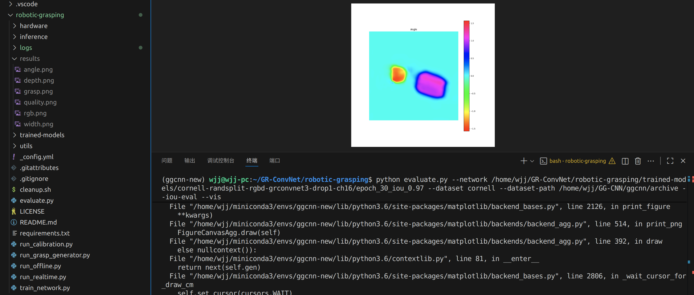

# GR-ConvNet笔记

仓库链接：https://github.com/skumra/robotic-grasping

环境配置和GGCNN通用，不配了

## 1.下载数据集

跳过，ggcnn下过了

## 2.克隆代码

```
git clone https://github.com/skumra/robotic-grasping.git
```

## 3.模型训练

可以使用 `train_network.py` 脚本训练模型。运行 `train_network.py --help` 以查看选项的完整列表。

Example for Cornell dataset:
康奈尔大学数据集示例：

```
python train_network.py --dataset cornell --dataset-path /home/wjj/GG-CNN/ggcnn/archive --description training_cornell
```

Example for Jacquard dataset:
提花数据集示例：

```
python train_network.py --dataset jacquard --dataset-path <Path To Dataset> --description training_jacquard --use-dropout 0 --input-size 300
```

## 4.模型评估
可以使用 `evaluate.py` 脚本评估训练的网络。运行 `evaluate.py --help` 以获取全套选项。

Example for Cornell dataset:
康奈尔大学数据集示例：

使用前新建一个results文件夹用来存放图片：

运行后马上ctrl+c,不然弹出一堆图片

```
python evaluate.py --network /home/wjj/GR-ConvNet/robotic-grasping/trained-models/cornell-randsplit-rgbd-grconvnet3-drop1-ch16/epoch_30_iou_0.97 --dataset cornell --dataset-path /home/wjj/GG-CNN/ggcnn/archive --iou-eval --vis
```



Example for Jacquard dataset:
提花数据集示例：

```
python evaluate.py --network <Path to Trained Network> --dataset jacquard --dataset-path <Path to Dataset> --iou-eval --use-dropout 0 --input-size 300
```