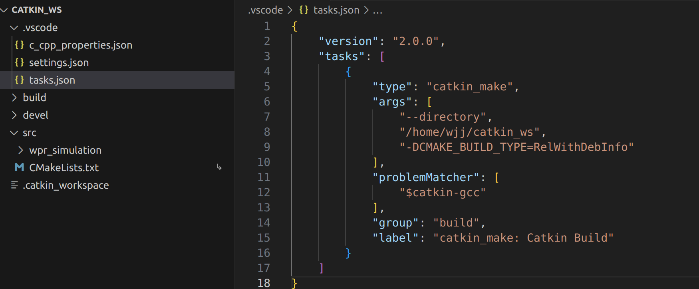
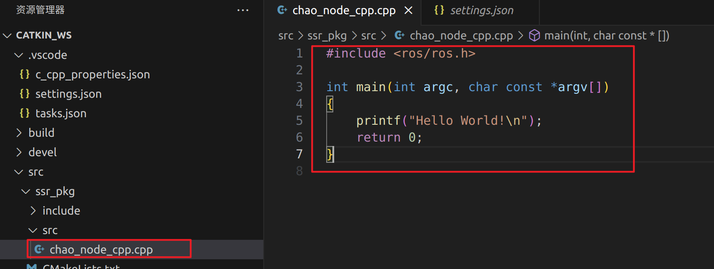
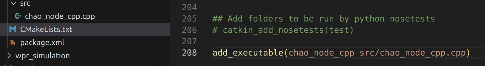
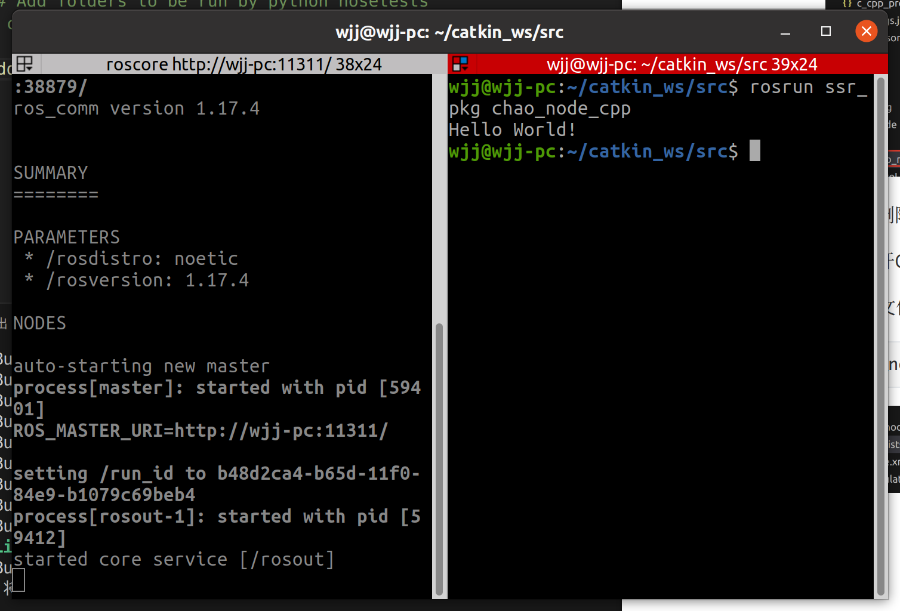
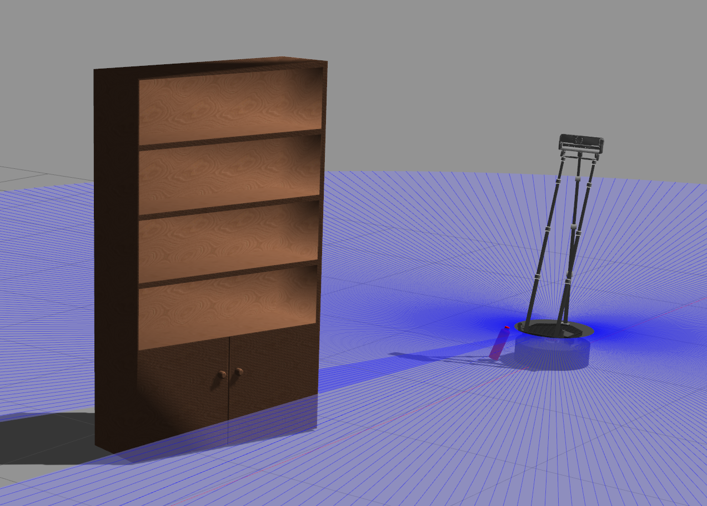

# Ros笔记（机器人工匠阿杰篇）

**以下内容跟随“机器人工匠阿杰”学习：**

## 1.从github下载软件包源代码并编译

配置工作空间，若未创建工作空间，先执行：

```
mkdir -p ~/catkin_ws/src 
```

进入src目录，git clone需要的软件包：

```
cd src/
git clone https://github.com/6-robot/wpr_simulation.git
```

进入下载软件包的script目录，进行软件包需要的相关依赖的安装：

```
cd ~/catkin_ws/src/wpr_simulation/scripts
./install_for_noetic.sh
```

之后进行软件包编译，注意需要在catkin_ws下执行编译：

```
cd ~/catkin_ws 
catkin_make
```

注：编译 ROS 包后，工作空间的 `devel` 目录下会生成 `setup.bash` 脚本，将当前工作空间中编译好的包的路径（如可执行文件、库、配置文件的位置）添加到 ROS 的环境变量中（例如 `ROS_PACKAGE_PATH`），让终端能够识别这些包的命令（如 `rosrun 包名 节点名` 时，系统能找到对应的可执行文件）。

编译成功后，加载新生成的环境变量：

```
source ~/catkin_ws/devel/setup.bash
```

将source指令添加到.barshrc中，这样工作空间中的软件包使用前就不需要手动source了

```
gedit ~/.bashrc
```

源码下载的软件包可以自行修改源代码并编译！！！

## 2.Vscode安装插件

安装Robot Developer Extensions for ROS 1和Cmake tools插件

之后，按下Ctrl+Shift+B选择：catkin make：catkin build

之后再点击该选项右侧的齿轮：



将"group": "build"修改为"group": {“kind”:"build","isDefault":true}

之后使用Ctrl+Shift+B就会默认使用该方式进行编译

## 3.初学ROS，年轻人的第一个Node节点

创建一个传感器包名叫ssr_pkg：

`catkin_create_pkg`：ROS 的功能包创建工具（基于 catkin 构建系统）

`sr_pkg`：新功能包的名称（自定义，建议小写 + 下划线，符合 ROS 命名规范）

后面的 `rospy`、`roscpp`、`std_msgs` 是该功能包的**依赖项**

```
cd catkin_ws/src/
catkin_create_pkg ssr_pkg rospy roscpp std_msgs
```

编写一个c++的chao_node_cpp.cpp节点

在ssr_pkg的src下新建chao_node_cpp.cpp，输入：

```c++
#include <ros/ros.h>

int main(int argc, char const *argv[])
{
    printf("Hello World!\n");
    return 0;
}
```



若头文件出现标红，可以删除c_cpp_properties.json然后重启Vscode解决

接下来进行源码编译，打开CMakeLists.txt，划到最底部，添加以下内容：

**作用**：将指定的 `.cpp` 源文件编译为可执行程序

```
add_executable(chao_node_cpp src/chao_node_cpp.cpp)
```



保存后进行编译，编译后进行测试：



测试成功（其实还要添加ros语句，cpp这里懒得弄了，python的搞了）！

同样，可以编写一个名为chao_node_py.py的节点，记得添加解释器声明:

```python
#!/usr/bin/env python3
import rospy

def main():
    # 初始化 ROS 节点（相当于 C++ 的 ros::init）
    rospy.init_node('hello_node', anonymous=True)
    print("Hello World!")

if __name__ == '__main__':
    main()
```

之后在终端中执行：

```
rosrun ssr_pkg chao_node_py.py
```

会得到同样的结果

## 4.Topic话题和Message消息

### C++实现话题发布：

```c++
#include <ros/ros.h>
#include <std_msgs/String.h>

int main(int argc, char *argv[])
{
    ros::init(argc,argv,"chao_node_cpp");//初始化节点，节点名chao_node_cpp需唯一

    ros::NodeHandle nh;//节点句柄，是 ROS 节点与系统交互的主要接口，用于创建发布者、订阅者、访问参数服务器等
    ros::Publisher pub = nh.advertise<std_msgs::String>("kuai_shang_che_kai_hei_qun",10);//创建话题类型、名称、队列长度

    ros:: Rate loop_rate(10);//定义循环频率为10Hz（即每秒执行 10 次循环），通过后续的loop_rate.sleep()实现精确延时

    while (ros::ok())
    {
        printf("我要开始刷屏了\n");
        std_msgs::String msg;
        msg.data ="国服马超，带飞";
        pub.publish(msg);
        loop_rate.sleep();// 按照10Hz频率休眠，控制循环速度（避免消息发布过快）
    }
    return 0;
}
```

Cmakelists.txt添加：

```cmake
add_executable(chao_node_cpp src/chao_node_cpp.cpp)

target_link_libraries(chao_node_cpp

  ${catkin_LIBRARIES}  # 链接ROS相关库

)
```

编译运行

可以在终端中使用**rostopic list**指令查看当前活跃的话题,**rostopic hz+话题名称** 统计指定话题中消息包发送频率

### C++实现话题订阅：

新建一个包，名叫atr_pkg，用于订阅话题

```
cd catkin_ws/src/
catkin_create_pkg atr_pkg rospy roscpp std_msgs
```

之后在该包下创建一个名叫ma_node_cpp.cpp的节点文件：

```c++
#include <ros/ros.h>
#include <std_msgs/String.h>

void chao_callback(std_msgs::String msg)//回调函数，订阅接受消息后自动调用
{
    printf(msg.data.c_str());
    printf("\n");
}

int main(int argc, char *argv[])
{
    ros::init(argc,argv,"ma_node_cpp");

    ros::NodeHandle nh;
    ros::Subscriber sub = nh.subscribe("kuai_shang_che_kai_hei_qun",10,chao_callback);

    while (ros::ok())
    {
        // 处理回调函数队列中的所有消息（必须调用，否则回调函数不会执行）
        ros::spinOnce();
    }
    return 0;
}
```

之后编译测试，该节点可以接收并打印来自chao_node_cpp发布的话题

### 使用launch文件启动C++节点

在atr_pkg文件夹下新建一个launch文件夹，之后在里面新建一个kaihei.launch，输入以下内容：

```xml
<launch>

    <node pkg="ssr_pkg" type="chao_node_cpp" name="chao_node"/>

    <node pkg="atr_pkg" type="ma_node_cpp" name="ma_node" output="screen"/>

</launch>
```

之后就可以使用指令一次性启动这两个节点（）

```
roslaunch atr_pkg kaihei.launch 
```

### Python实现话题发布：

在ssr_pkg下新建scripts下新建chao_node_py.py文件，内容如下：

```python
#!/usr/bin/env python3
#coding=utf-8

import rospy
from std_msgs.msg import String

if __name__ == '__main__':
    rospy.init_node("chao_node")
    rospy.logwarn("我的枪去而复返，你的生命有去无回！")

    pub = rospy.Publisher("kuai_sheng_che_kai_hei_qun",String,queue_size=10)

    rate =rospy.Rate(10)

    while not rospy.is_shutdown():
        rospy.loginfo("我要开始刷屏了")
        msg = String()
        msg.data = "国服马超，带飞"
        pub.publish(msg)
        rate.sleep()
```

保存后使用以下指令赋予可执行权限：

```
chmod +x chao_node_py.py
```

### Python实现话题订阅：

当节点的主要工作是**订阅话题、接收消息并执行回调函数**，且不需要在后台循环执行其他任务时，`rospy.spin()` 是最简洁的选择

在atr_pkg下新建scripts文件夹，里面新建ma_node_py.py文件，内容如下：

```python
#!/usr/bin/env python3
#coding=utf-8

import rospy
from std_msgs.msg import String

def chao_callback(msg):
    rospy.loginfo(msg.data)

if __name__ == '__main__':
    rospy.init_node("ma_node")

    sub = rospy.Subscriber("kuai_sheng_che_kai_hei_qun",String,chao_callback,queue_size=10)

    rospy.spin()# 阻塞等待，直到节点退出，期间自动处理回调
```

### 使用launch文件启动Py节点

在atr_pkg文件夹下新建一个launch文件夹，之后在里面新建一个kaihei_py.launch，输入以下内容：

```xml
<launch>

    <node pkg="ssr_pkg" type="chao_node_py.py" name="chao_node"/>

    <node pkg="atr_pkg" type="ma_node_py.py" name="ma_node" output="screen"/>

</launch>
```

之后就可以使用指令一次性启动这两个节点（）

```
roslaunch atr_pkg kaihei_py.launch 
```

### 5.机器人运动控制

新建一个软件包，叫做vel_pkg：

```
catkin_create_pkg vel_pkg roscpp rospy geometry_msgs
```

### c++实现

编写vel_node.cpp:

```c++
#include <ros/ros.h>
#include <geometry_msgs/Twist.h>

int main(int argc, char** argv)
{
  ros::init(argc, argv, "vel_node");

  ros::NodeHandle n;
  ros::Publisher vel_pub = n.advertise<geometry_msgs::Twist>("/cmd_vel", 10);

  geometry_msgs::Twist vel_msg;
  vel_msg.linear.x = 0.1;//0.1米每秒
  vel_msg.linear.y = 0.0;
  vel_msg.linear.z = 0.0;
  vel_msg.angular.x = 0;
  vel_msg.angular.y = 0;
  vel_msg.angular.z = 0;

  ros::Rate r(30);
  while(ros::ok())
  {
    vel_pub.publish(vel_msg);
    r.sleep();
  }

  return 0;
}
```

Cmakelists.txt添加：

```cmake
add_executable(vel_node src/vel_node.cpp)
add_dependencies(vel_node ${${PROJECT_NAME}_EXPORTED_TARGETS} ${catkin_EXPORTED_TARGETS})
target_link_libraries(vel_node
  ${catkin_LIBRARIES}
)
```

编译后运行：

```
roslaunch wpr_simulation wpb_simple.launch 
rosrun vel_pkg vel_node 
```



即可实现机器人每秒1m前进效果

### Python实现

编写vel_node.py:

```python
#!/usr/bin/env python3
# coding=utf-8

import rospy
from geometry_msgs.msg import Twist

if __name__ == "__main__":
    rospy.init_node("vel_node")
    # 发布速度控制话题
    vel_pub = rospy.Publisher("cmd_vel",Twist,queue_size=10)
    # 构建速度消息包并赋值
    vel_msg = Twist()
    vel_msg.linear.x = 0.1
    # 构建发送频率对象
    rate = rospy.Rate(10)
    while not rospy.is_shutdown():
        vel_pub.publish(vel_msg)
        rate.sleep()
```

编译后运行：

```
roslaunch wpr_simulation wpb_simple.launch 
rosrun vel_pkg vel_node.py
```

# Ros笔记（赵虚左篇）

官方讲义：http://www.autolabor.com.cn/book/ROSTutorials/di-2-zhang-ros-jia-gou-she-ji.html

该部分直接看讲义就行

## 1.服务通信


