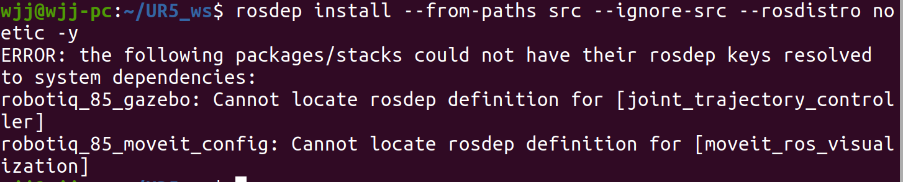
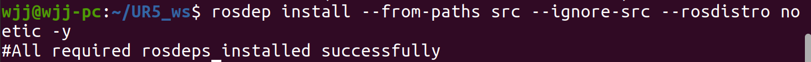
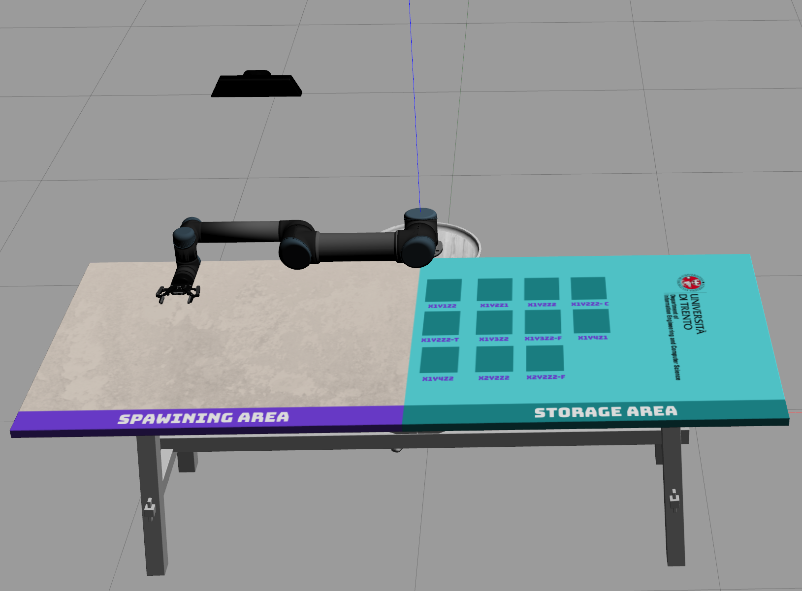
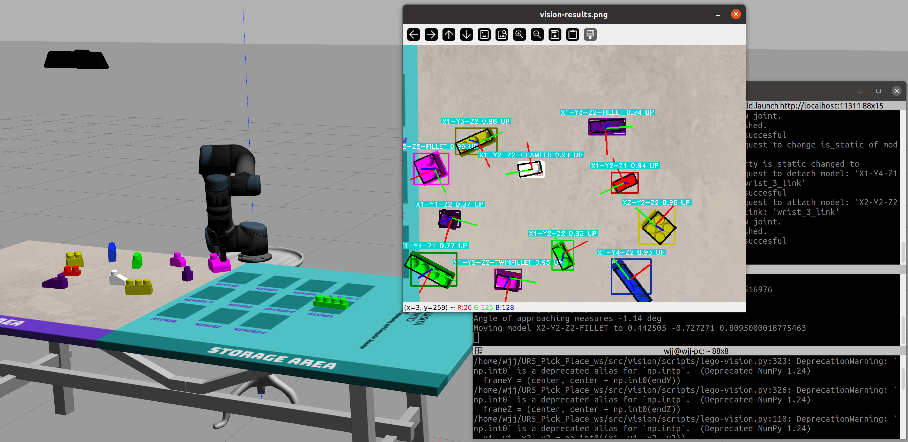
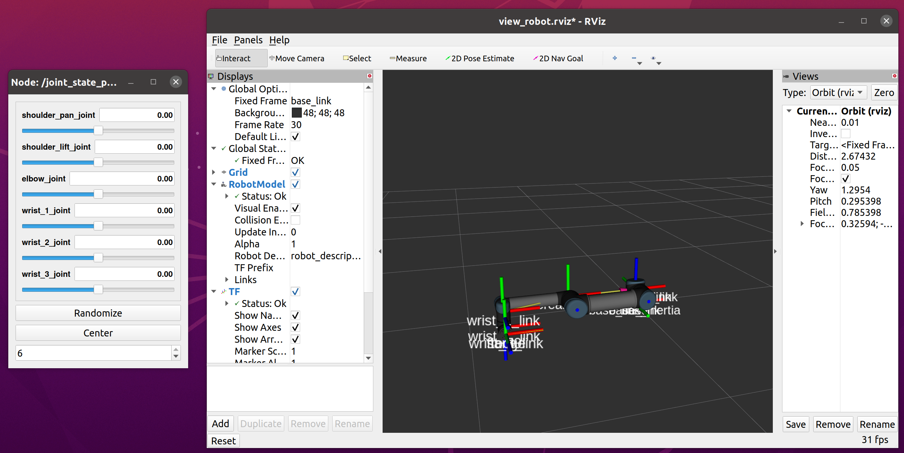
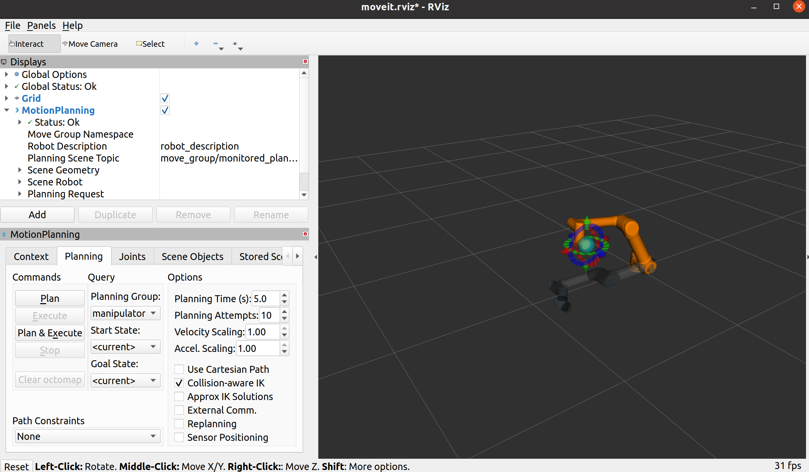
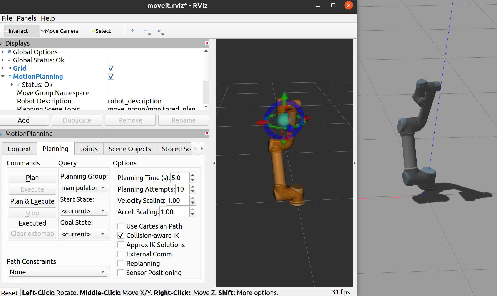
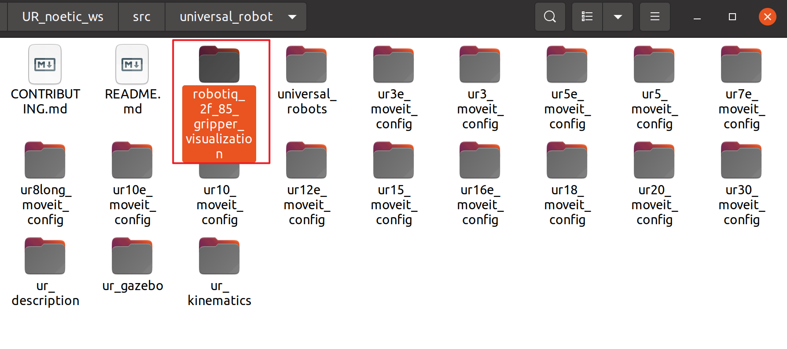
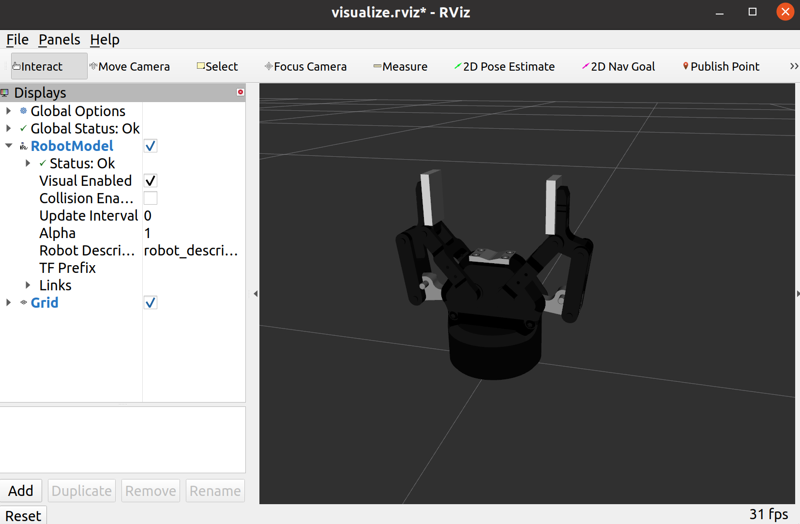
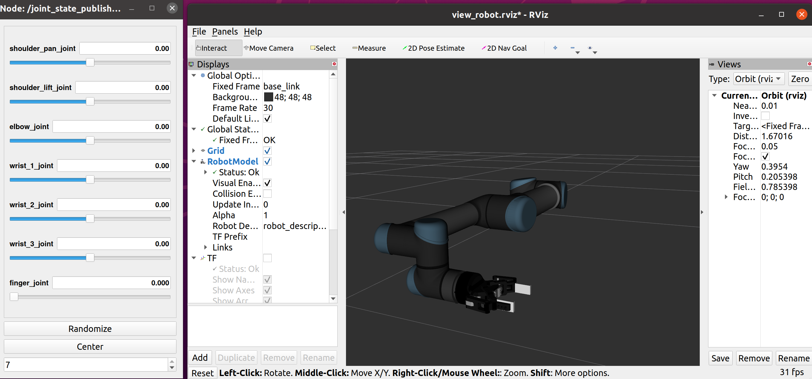

# Ros笔记（机器人工匠阿杰篇）

**以下内容跟随“机器人工匠阿杰”学习：**

## 1.从github下载软件包源代码并编译

配置工作空间，若未创建工作空间，先执行：

```
mkdir -p ~/catkin_ws/src 
```

进入src目录，git clone需要的软件包：

```
cd src/
git clone https://github.com/6-robot/wpr_simulation.git
```

进入下载软件包的script目录，进行软件包需要的相关依赖的安装：

```
cd ~/catkin_ws/src/wpr_simulation/scripts
./install_for_noetic.sh
```

之后进行软件包编译，注意需要在catkin_ws下执行编译：

```
cd ~/catkin_ws 
catkin_make
```

注：编译 ROS 包后，工作空间的 `devel` 目录下会生成 `setup.bash` 脚本，将当前工作空间中编译好的包的路径（如可执行文件、库、配置文件的位置）添加到 ROS 的环境变量中（例如 `ROS_PACKAGE_PATH`），让终端能够识别这些包的命令（如 `rosrun 包名 节点名` 时，系统能找到对应的可执行文件）。

编译成功后，加载新生成的环境变量：

```
source ~/catkin_ws/devel/setup.bash
```

将source指令添加到.barshrc中，这样工作空间中的软件包使用前就不需要手动source了

```
gedit ~/.bashrc
```

源码下载的软件包可以自行修改源代码并编译！！！

## 2.Vscode安装插件

安装Robot Developer Extensions for ROS 1和Cmake tools插件

之后，按下Ctrl+Shift+B选择：catkin make：catkin build

之后再点击该选项右侧的齿轮：


将"group": "build"修改为"group": {“kind”:"build","isDefault":true}

之后使用Ctrl+Shift+B就会默认使用该方式进行编译

## 3.初学ROS，年轻人的第一个Node节点

创建一个传感器包名叫ssr_pkg：

`catkin_create_pkg`：ROS 的功能包创建工具（基于 catkin 构建系统）

`sr_pkg`：新功能包的名称（自定义，建议小写 + 下划线，符合 ROS 命名规范）

后面的 `rospy`、`roscpp`、`std_msgs` 是该功能包的**依赖项**

```
cd catkin_ws/src/
catkin_create_pkg ssr_pkg rospy roscpp std_msgs
```

编写一个c++的chao_node_cpp.cpp节点

在ssr_pkg的src下新建chao_node_cpp.cpp，输入：

```c++
#include <ros/ros.h>

int main(int argc, char const *argv[])
{
    printf("Hello World!\n");
    return 0;
}
```


若头文件出现标红，可以删除c_cpp_properties.json然后重启Vscode解决

接下来进行源码编译，打开CMakeLists.txt，划到最底部，添加以下内容：

**作用**：将指定的 `.cpp` 源文件编译为可执行程序

```
add_executable(chao_node_cpp src/chao_node_cpp.cpp)
```


保存后进行编译，编译后进行测试：


测试成功（其实还要添加ros语句，cpp这里懒得弄了，python的搞了）！

同样，可以编写一个名为chao_node_py.py的节点，记得添加解释器声明:

```python
#!/usr/bin/env python3
import rospy

def main():
    # 初始化 ROS 节点（相当于 C++ 的 ros::init）
    rospy.init_node('hello_node', anonymous=True)
    print("Hello World!")

if __name__ == '__main__':
    main()
```

之后在终端中执行：

```
rosrun ssr_pkg chao_node_py.py
```

会得到同样的结果

## 4.Topic话题和Message消息

### C++实现话题发布：

```c++
#include <ros/ros.h>
#include <std_msgs/String.h>

int main(int argc, char *argv[])
{
    ros::init(argc,argv,"chao_node_cpp");//初始化节点，节点名chao_node_cpp需唯一

    ros::NodeHandle nh;//节点句柄，是 ROS 节点与系统交互的主要接口，用于创建发布者、订阅者、访问参数服务器等
    ros::Publisher pub = nh.advertise<std_msgs::String>("kuai_shang_che_kai_hei_qun",10);//创建话题类型、名称、队列长度

    ros:: Rate loop_rate(10);//定义循环频率为10Hz（即每秒执行 10 次循环），通过后续的loop_rate.sleep()实现精确延时

    while (ros::ok())
    {
        printf("我要开始刷屏了\n");
        std_msgs::String msg;
        msg.data ="国服马超，带飞";
        pub.publish(msg);
        loop_rate.sleep();// 按照10Hz频率休眠，控制循环速度（避免消息发布过快）
    }
    return 0;
}
```

Cmakelists.txt添加：

```cmake
add_executable(chao_node_cpp src/chao_node_cpp.cpp)

target_link_libraries(chao_node_cpp

  ${catkin_LIBRARIES}  # 链接ROS相关库

)
```

编译运行

可以在终端中使用**rostopic list**指令查看当前活跃的话题,**rostopic hz+话题名称** 统计指定话题中消息包发送频率

### C++实现话题订阅：

新建一个包，名叫atr_pkg，用于订阅话题

```
cd catkin_ws/src/
catkin_create_pkg atr_pkg rospy roscpp std_msgs
```

之后在该包下创建一个名叫ma_node_cpp.cpp的节点文件：

```c++
#include <ros/ros.h>
#include <std_msgs/String.h>

void chao_callback(std_msgs::String msg)//回调函数，订阅接受消息后自动调用
{
    printf(msg.data.c_str());
    printf("\n");
}

int main(int argc, char *argv[])
{
    ros::init(argc,argv,"ma_node_cpp");

    ros::NodeHandle nh;
    ros::Subscriber sub = nh.subscribe("kuai_shang_che_kai_hei_qun",10,chao_callback);

    while (ros::ok())
    {
        // 处理回调函数队列中的所有消息（必须调用，否则回调函数不会执行）
        ros::spinOnce();
    }
    return 0;
}
```

之后编译测试，该节点可以接收并打印来自chao_node_cpp发布的话题

### 使用launch文件启动C++节点

在atr_pkg文件夹下新建一个launch文件夹，之后在里面新建一个kaihei.launch，输入以下内容：

```xml
<launch>

    <node pkg="ssr_pkg" type="chao_node_cpp" name="chao_node"/>

    <node pkg="atr_pkg" type="ma_node_cpp" name="ma_node" output="screen"/>

</launch>
```

之后就可以使用指令一次性启动这两个节点（）

```
roslaunch atr_pkg kaihei.launch 
```

### Python实现话题发布：

在ssr_pkg下新建scripts下新建chao_node_py.py文件，内容如下：

```python
#!/usr/bin/env python3
#coding=utf-8

import rospy
from std_msgs.msg import String

if __name__ == '__main__':
    rospy.init_node("chao_node")
    rospy.logwarn("我的枪去而复返，你的生命有去无回！")

    pub = rospy.Publisher("kuai_sheng_che_kai_hei_qun",String,queue_size=10)

    rate =rospy.Rate(10)

    while not rospy.is_shutdown():
        rospy.loginfo("我要开始刷屏了")
        msg = String()
        msg.data = "国服马超，带飞"
        pub.publish(msg)
        rate.sleep()
```

保存后使用以下指令赋予可执行权限：

```
chmod +x chao_node_py.py
```

### Python实现话题订阅：

当节点的主要工作是**订阅话题、接收消息并执行回调函数**，且不需要在后台循环执行其他任务时，`rospy.spin()` 是最简洁的选择

在atr_pkg下新建scripts文件夹，里面新建ma_node_py.py文件，内容如下：

```python
#!/usr/bin/env python3
#coding=utf-8

import rospy
from std_msgs.msg import String

def chao_callback(msg):
    rospy.loginfo(msg.data)

if __name__ == '__main__':
    rospy.init_node("ma_node")

    sub = rospy.Subscriber("kuai_sheng_che_kai_hei_qun",String,chao_callback,queue_size=10)

    rospy.spin()# 阻塞等待，直到节点退出，期间自动处理回调
```

### 使用launch文件启动Py节点

在atr_pkg文件夹下新建一个launch文件夹，之后在里面新建一个kaihei_py.launch，输入以下内容：

```xml
<launch>

    <node pkg="ssr_pkg" type="chao_node_py.py" name="chao_node"/>

    <node pkg="atr_pkg" type="ma_node_py.py" name="ma_node" output="screen"/>

</launch>
```

之后就可以使用指令一次性启动这两个节点（）

```
roslaunch atr_pkg kaihei_py.launch 
```

### 5.机器人运动控制

新建一个软件包，叫做vel_pkg：

```
catkin_create_pkg vel_pkg roscpp rospy geometry_msgs
```

### c++实现

编写vel_node.cpp:

```c++
#include <ros/ros.h>
#include <geometry_msgs/Twist.h>

int main(int argc, char** argv)
{
  ros::init(argc, argv, "vel_node");

  ros::NodeHandle n;
  ros::Publisher vel_pub = n.advertise<geometry_msgs::Twist>("/cmd_vel", 10);

  geometry_msgs::Twist vel_msg;
  vel_msg.linear.x = 0.1;//0.1米每秒
  vel_msg.linear.y = 0.0;
  vel_msg.linear.z = 0.0;
  vel_msg.angular.x = 0;
  vel_msg.angular.y = 0;
  vel_msg.angular.z = 0;

  ros::Rate r(30);
  while(ros::ok())
  {
    vel_pub.publish(vel_msg);
    r.sleep();
  }

  return 0;
}
```

Cmakelists.txt添加：

```cmake
add_executable(vel_node src/vel_node.cpp)
add_dependencies(vel_node ${${PROJECT_NAME}_EXPORTED_TARGETS} ${catkin_EXPORTED_TARGETS})
target_link_libraries(vel_node
  ${catkin_LIBRARIES}
)
```

编译后运行：

```
roslaunch wpr_simulation wpb_simple.launch 
rosrun vel_pkg vel_node 
```


即可实现机器人每秒1m前进效果

### Python实现

编写vel_node.py:

```python
#!/usr/bin/env python3
# coding=utf-8

import rospy
from geometry_msgs.msg import Twist

if __name__ == "__main__":
    rospy.init_node("vel_node")
    # 发布速度控制话题
    vel_pub = rospy.Publisher("cmd_vel",Twist,queue_size=10)
    # 构建速度消息包并赋值
    vel_msg = Twist()
    vel_msg.linear.x = 0.1
    # 构建发送频率对象
    rate = rospy.Rate(10)
    while not rospy.is_shutdown():
        vel_pub.publish(vel_msg)
        rate.sleep()
```

编译后运行：

```
roslaunch wpr_simulation wpb_simple.launch 
rosrun vel_pkg vel_node.py
```

# Ros笔记（赵虚左篇）

官方讲义：http://www.autolabor.com.cn/book/ROSTutorials/di-2-zhang-ros-jia-gou-she-ji.html

该部分直接看视频和讲义就行

# ROS笔记（仿真抓取复现篇）

复现链接1：https://github.com/Suyixiu/robot_sim

视频1：https://www.bilibili.com/video/BV19f4y1h73E/?spm_id_from=trigger_reload&vd_source=425167508f9e3d1f23c644a6948470f1

复现链接2：https://github.com/gjt15083576031/UR5_gripper_camera_gazebo

视频2：https://www.bilibili.com/video/BV18j41127qy/?spm_id_from=333.337.search-card.all.click&vd_source=425167508f9e3d1f23c644a6948470f1


## 复现1：

https://github.com/gjt15083576031/UR5_gripper_camera_gazebo的main分支复现：

### 1.新建工作空间并初始化：

```bash
mkdir -p ~/UR5_ws/src
cd ~/UR5_ws/src
catkin_init_workspace
```

### 2.安装依赖

```bash
sudo apt install ros-noetic-object-recognition-msgs

cd ~/UR5_ws
# 自动安装依赖，这一步网络要通畅（不知道为什么使用系统自带终端就可以，超级终端网络访问就有问题）
rosdep update
rosdep install --from-paths src --ignore-src -r -y
```

检查是否有遗漏的包：

```
rosdep install --from-paths src --ignore-src --rosdistro noetic -y
```



继续安装缺失的包：

```bash
# joint_trajectory_controller 是 ros_control 框架的一部分，负责控制机械臂的轨迹规划
sudo apt install ros-noetic-joint-trajectory-controller
# moveit_ros_visualization 是 MoveIt! 中的可视化包，负责在 RViz 中显示运动规划的结果
sudo apt install ros-noetic-moveit-ros-visualization
```


```bash
# moveit_planners_ompl 是 MoveIt! 的规划器插件，用于基于 OMPL（Open Motion Planning Library）提供运动规划功能
sudo apt install ros-noetic-moveit-planners-ompl
# ros_controllers 是 ros_control 框架的一部分，提供了一系列控制器接口和功能，通常用来控制机械臂的关节和执行器
sudo apt install ros-noetic-ros-control ros-noetic-ros-controllers
```



最后再来一个：

```bash
sudo apt-get install ros-noetic-rqt-joint-trajectory-controller
```

### 3.编译工作空间

```bash
cd ~/UR5_ws
catkin_make
# 编译完成后加载工作空间环境
source devel/setup.bash
```

### 4.运行功能

根据README.md中的说明，可执行以下操作：

1. 在 RViz 中查看模型

   ```bash
   roslaunch gjt_ur_description view_ur5_robotiq85_gripper.launch
   ```

2. 在 Gazebo 中启动仿真

   ```bash
   roslaunch gjt_ur_gazebo ur5.launch
   ```

3. 查看相机数据（RGB+Depth）

   ```bash
   rqt_image_view
   ```


https://zhuanlan.zhihu.com/p/665386639复现：

```
sudo apt-get install ros-noetic-moveit-simple-controller-manager
```

## 复现2：

https://github.com/pietrolechthaler/UR5-Pick-and-Place-Simulation?tab=readme-ov-file#usage的复现，该代码没有用到moveit

### 1.新建工作空间：

```bash
mkdir -p ~/UR5_Pick_Place_ws/src
```

### 2.下载并调整目录结构

**这一步在系统python环境下编译：**

把下载后的src替换掉工作空间的src

然后catkin build

官方说用build就用build吧

### 3.安装yolov5

新建一个虚拟环境，就叫yolo吧：

```bash
# 用3.8.10，不然后面要报错
conda create -n yolo python=3.8.10
conda activate yolo
```

```
cd ~
git clone https://github.com/ultralytics/yolo
cd yolo
pip3 install -r requirements.txt
```

之后还要安装rospy，不然在虚拟环境下无法启动roscore:

```bash
# 安装 rospkg 及相关依赖
pip install rospkg catkin_pkg empy==3.3.2 defusedxml
```

总结：编译要在系统环境编译，运行要在虚拟环境中运行，超级终端每新建一个终端都要激活一下虚拟环境

**补充：后面发现，是empy这个包的版本不对，导致的编译失败，系统环境下的版本是3.3.2，而虚拟环境的是4.2，卸载重装后，在虚拟环境里也可以编译了!!!**

### 4.使用方法

**这一步要先进入虚拟环境**！！！：

启动世界：

```
roslaunch levelManager lego_world.launch
```


选择级别（从 1 到 4）：

```bash
#rosrun levelManager levelManager.py -l [level]

#这里选择等级2
rosrun levelManager levelManager.py -l 2
```

启动运动学过程：

```
rosrun motion_planning motion_planning.py
```

启动本地化流程（**这一步要很久，耐心等待，因为用的python3.8，yolo会警告两次才继续执行**）：

```
 rosrun vision lego-vision.py -show
```

- `-show` : show the results of the recognition and localization process with an image
  `-show` ：用图像显示识别和定位过程的结果



# UR机械臂官方包

b站up“哈萨克斯坦x“解读链接：https://github.com/littlefive-robot/open_source_project_list

Moveit官方文档：https://moveit.github.io/moveit_tutorials/

UR机械臂noetic版本链接：https://github.com/ros-industrial/universal_robot/tree/noetic-devel

使用真实机械臂需要这个包：https://github.com/UniversalRobots/Universal_Robots_ROS_Driver

**注：下载的是1.5.0版本**

## 1.新建工作空间：

```bash
mkdir -p ~/UR_noetic_ws/src
cd ~/UR_noetic_ws/src

git clone -b noetic-devel https://github.com/ros-industrial/universal_robot.git

cd ~/UR_noetic_ws/

rosdep update
rosdep install --rosdistro noetic --ignore-src --from-paths src

# trac_ik_kinematics_plugin 是 MoveIt! 中的一种逆运动学（IK）插件
sudo apt install ros-noetic-trac-ik-kinematics-plugin

sudo apt install ros-noetic-moveit-setup-assistant

sudo apt install ros-noetic-moveit

sudo apt install ros-noetic-warehouse-ros-mongo

# building
catkin_make

# activate this workspace
gedit ~/.bashrc
# 添加如下语句：
source ~/UR_noetic_ws/devel/setup.bash

```

## 2.在rviz中查看机械臂模型

```
roslaunch ur_description view_ur5.launch 
```



以下是关于view_ur5.launch的套娃解读

### view_ur5.launch：

```xml
<?xml version="1.0"?>
<launch>
  <include file="$(find ur_description)/launch/load_ur5.launch"/>

  <node name="joint_state_publisher_gui" pkg="joint_state_publisher_gui" type="joint_state_publisher_gui" />
  <node name="robot_state_publisher" pkg="robot_state_publisher" type="robot_state_publisher" />
  <node name="rviz" pkg="rviz" type="rviz" args="-d $(find ur_description)/cfg/view_robot.rviz" required="true" />
</launch>
```

### load_ur5.launch：

joint_limits.yaml：定义每个关节的最大/最小角度、速度、力矩限制

default_kinematics.yaml：定义正/逆运动学参数，比如 DH 参数、关节偏移

physical_parameters.yaml：定义物理属性（质量、惯性、重心等）

visual_parameters.yaml：定义模型外观（颜色、mesh 模型路径等）

robot_model：告诉下游文件当前使用的机器人型号是 **UR5**

`pass_all_args="true"` 把上面定义的所有参数都传进去load_ur.launch

```xml
<?xml version="1.0"?>
<launch>
  <!--ur5 parameters files -->
  <arg name="joint_limit_params" default="$(find ur_description)/config/ur5/joint_limits.yaml"/>
  <arg name="kinematics_params" default="$(find ur_description)/config/ur5/default_kinematics.yaml"/>
  <arg name="physical_params" default="$(find ur_description)/config/ur5/physical_parameters.yaml"/>
  <arg name="visual_params" default="$(find ur_description)/config/ur5/visual_parameters.yaml"/>
  <!--common parameters -->
  <arg name="transmission_hw_interface" default="hardware_interface/PositionJointInterface" />
  <arg name="safety_limits" default="false" doc="If True, enable the safety limits controller"/>
  <arg name="safety_pos_margin" default="0.15" doc="The lower/upper limits in the safety controller" />
  <arg name="safety_k_position" default="20" doc="Used to set k position in the safety controller" />

  <arg name="robot_model" value="ur5" />

  <!-- use common launch file and pass all arguments to it -->
  <include file="$(find ur_description)/launch/load_ur.launch" pass_all_args="true"/>
</launch>
```

### load_ur.launch：

`doc="YAML file containing the joint limit values"`意思就是：这个 `joint_limit_params` 参数用于指定 “包含关节限制值的 YAML 文件”。

```xml
<?xml version="1.0"?>
<launch>
  <!--ur parameters files -->
  <arg name="joint_limit_params" doc="YAML file containing the joint limit values"/>
  <arg name="kinematics_params" doc="YAML file containing the robot's kinematic parameters. These will be different for each robot as they contain the robot's calibration."/>
  <arg name="physical_params" doc="YAML file containing the phycical parameters of the robots"/>
  <arg name="visual_params" doc="YAML file containing the visual model of the robots"/>
  <!--common parameters  -->
  <arg name="transmission_hw_interface" default="hardware_interface/PositionJointInterface" />
  <arg name="safety_limits" default="false" doc="If True, enable the safety limits controller"/>
  <arg name="safety_pos_margin" default="0.15" doc="The lower/upper limits in the safety controller" />
  <arg name="safety_k_position" default="20" doc="Used to set k position in the safety controller" />

  <arg name="robot_model" />

  <!-- 
	加载顶层（即：独立且完整的）xacro 文件，该文件对应由一组 yaml 参数文件定义的 UR 机器人型号（例如，要将 UR5 加载到 ROS 参数服务器上，需提供包含限位、运动学、物理和视觉参数的.yaml 文件路径，这些参数共同描述了一台 UR5 机器人）。
	注意：用户通常会希望使用此目录下的其他.launch 文件（即 “load_urXXX.launch”），因为这些文件已经包含了各种受支持机器人所需参数的适当默认值。
	注意 2：如果您有自定义的机器人配置，或者您的机器人已集成到工作单元中，请勿修改此文件，也不要将所有工作单元对象添加到 ur.xacro 文件中。请创建一个新的顶层 xacro 文件，并将 ur_macro.xacro 文件包含其中。然后编写一个新的.launch 文件，将其加载到参数服务器上。
  -->
  <!-- 
	将这些参数传入到 ur.xacro 文件中，用于动态生成机器人模型的描述
  -->
  <param name="robot_description" command="$(find xacro)/xacro '$(find ur_description)/urdf/ur.xacro'
    robot_model:=$(arg robot_model)
    joint_limit_params:=$(arg joint_limit_params)
    kinematics_params:=$(arg kinematics_params)
    physical_params:=$(arg physical_params)
    visual_params:=$(arg visual_params)
    transmission_hw_interface:=$(arg transmission_hw_interface)
    safety_limits:=$(arg safety_limits)
    safety_pos_margin:=$(arg safety_pos_margin)
    safety_k_position:=$(arg safety_k_position)"
    />
</launch>
```

### ur.xacro：

```xml
<?xml version="1.0"?>
<robot xmlns:xacro="http://wiki.ros.org/xacro" name="$(arg robot_model)_robot">

   <!-- import main macro -->
   <xacro:include filename="$(find ur_description)/urdf/inc/ur_macro.xacro"/>

   <!-- parameters -->
   <xacro:arg name="joint_limit_params" default=""/>
   <xacro:arg name="kinematics_params" default=""/>
   <xacro:arg name="physical_params" default=""/>
   <xacro:arg name="visual_params" default=""/>
   <!-- legal values:
         - hardware_interface/PositionJointInterface
         - hardware_interface/VelocityJointInterface
         - hardware_interface/EffortJointInterface
   -->
   <xacro:arg name="transmission_hw_interface" default="hardware_interface/PositionJointInterface"/>
   <xacro:arg name="safety_limits" default="false"/>
   <xacro:arg name="safety_pos_margin" default="0.15"/>
   <xacro:arg name="safety_k_position" default="20"/>

   <!-- arm 调用ur_macro.xacro中定义的ur_robot宏，传入上面声明的所有参数，生成具体的机器人模型 -->
   <xacro:ur_robot
     prefix=""
     joint_limits_parameters_file="$(arg joint_limit_params)"
     kinematics_parameters_file="$(arg kinematics_params)"
     physical_parameters_file="$(arg physical_params)"
     visual_parameters_file="$(arg visual_params)"
     transmission_hw_interface="$(arg transmission_hw_interface)"
     safety_limits="$(arg safety_limits)"
     safety_pos_margin="$(arg safety_pos_margin)"
     safety_k_position="$(arg safety_k_position)"/>
</robot>
```

### ur_macro.xacro：

```xml
<?xml version="1.0"?>
<robot xmlns:xacro="http://wiki.ros.org/xacro">
  <!--
    Base UR robot series xacro macro.

    NOTE: this is NOT a URDF. It cannot directly be loaded by consumers
    expecting a flattened '.urdf' file. See the top-level '.xacro' for that
    (but note: that .xacro must still be processed by the xacro command).

    For use in '.launch' files: use one of the 'load_urX.launch' convenience
    launch files.

    This file models the base kinematic chain of a UR robot, which then gets
    parameterised by various configuration files to convert it into a UR3(e),
    UR5(e), UR7e, UR10(e), UR12e UR16e, UR8Long, UR15, UR18, UR20 or UR30.

    NOTE: the default kinematic parameters (ie: link lengths, frame locations,
    offets, etc) do not correspond to any particular robot. They are defaults
    only. There WILL be non-zero offsets between the Forward Kinematics results
    in TF (ie: robot_state_publisher) and the values reported by the Teach
    Pendant.

    For accurate (and robot-specific) transforms, the 'kinematics_parameters_file'
    parameter MUST point to a .yaml file containing the appropriate values for
    the targetted robot.

    If using the UniversalRobots/Universal_Robots_ROS_Driver, follow the steps
    described in the readme of that repository to extract the kinematic
    calibration from the controller and generate the required .yaml file.

    Main author of the migration to yaml configs: Ludovic Delval.

    Contributors to previous versions (in no particular order):

     - Felix Messmer
     - Kelsey Hawkins
     - Wim Meeussen
     - Shaun Edwards
     - Nadia Hammoudeh Garcia
     - Dave Hershberger
     - G. vd. Hoorn
     - Philip Long
     - Dave Coleman
     - Miguel Prada
     - Mathias Luedtke
     - Marcel Schnirring
     - Felix von Drigalski
     - Felix Exner
     - Jimmy Da Silva
     - Ajit Krisshna N L
     - Muhammad Asif Rana
  -->

  <xacro:include filename="$(find ur_description)/urdf/inc/ur_transmissions.xacro" />
  <xacro:include filename="$(find ur_description)/urdf/inc/ur_common.xacro" />

  <xacro:macro name="ur_robot" params="
    prefix
    joint_limits_parameters_file
    kinematics_parameters_file
    physical_parameters_file
    visual_parameters_file
    transmission_hw_interface:=hardware_interface/PositionJointInterface
    safety_limits:=false
    safety_pos_margin:=0.15
    safety_k_position:=20"
  >
    <!-- Load configuration data from the provided .yaml files -->
    <xacro:read_model_data
      joint_limits_parameters_file="${joint_limits_parameters_file}" 
      kinematics_parameters_file="${kinematics_parameters_file}"
      physical_parameters_file="${physical_parameters_file}"
      visual_parameters_file="${visual_parameters_file}"/>

    <!-- Add URDF transmission elements (for ros_control) -->
    <xacro:ur_arm_transmission prefix="${prefix}" hw_interface="${transmission_hw_interface}" />

    <!-- links: main serial chain -->
    <link name="${prefix}base_link"/>
    <link name="${prefix}base_link_inertia">
      <visual>
        <origin xyz="0 0 0" rpy="0 0 ${pi}"/>
        <geometry>
          <mesh filename="${base_visual_mesh}"/>
        </geometry>
        <material name="${base_visual_material_name}">
          <color rgba="${base_visual_material_color}"/>
        </material>
      </visual>
      <collision>
        <origin xyz="0 0 0" rpy="0 0 ${pi}"/>
        <geometry>
          <mesh filename="${base_collision_mesh}"/>
        </geometry>
      </collision>
      <xacro:cylinder_inertial radius="${base_inertia_radius}" length="${base_inertia_length}" mass="${base_mass}">
        <origin xyz="0 0 0" rpy="0 0 0" />
      </xacro:cylinder_inertial>
    </link>
    <link name="${prefix}shoulder_link">
      <visual>
        <origin xyz="0 0 0" rpy="0 0 ${pi}"/>
        <geometry>
          <mesh filename="${shoulder_visual_mesh}"/>
        </geometry>
        <material name="${shoulder_visual_material_name}">
          <color rgba="${shoulder_visual_material_color}"/>
        </material>
      </visual>
      <collision>
        <origin xyz="0 0 0" rpy="0 0 ${pi}"/>
        <geometry>
          <mesh filename="${shoulder_collision_mesh}"/>
        </geometry>
      </collision>
      <inertial>
        <mass value="${shoulder_mass}"/>
        <origin rpy="${shoulder_inertia_rotation}" xyz="${shoulder_cog}"/>
        <inertia
            ixx="${shoulder_inertia_ixx}"
            ixy="${shoulder_inertia_ixy}"
            ixz="${shoulder_inertia_ixz}"
            iyy="${shoulder_inertia_iyy}"
            iyz="${shoulder_inertia_iyz}"
            izz="${shoulder_inertia_izz}"
        />
      </inertial>
    </link>
    <link name="${prefix}upper_arm_link">
      <visual>
        <origin xyz="0 0 ${shoulder_offset}" rpy="${pi/2} 0 ${-pi/2}"/>
        <geometry>
          <mesh filename="${upper_arm_visual_mesh}"/>
        </geometry>
        <material name="${upper_arm_visual_material_name}">
          <color rgba="${upper_arm_visual_material_color}"/>
        </material>
      </visual>
      <collision>
        <origin xyz="0 0 ${shoulder_offset}" rpy="${pi/2} 0 ${-pi/2}"/>
        <geometry>
          <mesh filename="${upper_arm_collision_mesh}"/>
        </geometry>
      </collision>
      <inertial>
        <mass value="${upper_arm_mass}"/>
        <origin rpy="${upper_arm_inertia_rotation}" xyz="${upper_arm_cog}"/>
        <inertia
            ixx="${upper_arm_inertia_ixx}"
            ixy="${upper_arm_inertia_ixy}"
            ixz="${upper_arm_inertia_ixz}"
            iyy="${upper_arm_inertia_iyy}"
            iyz="${upper_arm_inertia_iyz}"
            izz="${upper_arm_inertia_izz}"
        />
      </inertial>
    </link>
    <link name="${prefix}forearm_link">
      <visual>
        <origin xyz="0 0 ${elbow_offset}" rpy="${pi/2} 0 ${-pi/2}"/>
        <geometry>
          <mesh filename="${forearm_visual_mesh}"/>
        </geometry>
        <material name="${forearm_visual_material_name}">
          <color rgba="${forearm_visual_material_color}"/>
        </material>
      </visual>
      <collision>
        <origin xyz="0 0 ${elbow_offset}" rpy="${pi/2} 0 ${-pi/2}"/>
        <geometry>
          <mesh filename="${forearm_collision_mesh}"/>
        </geometry>
      </collision>
      <inertial>
        <mass value="${forearm_mass}"/>
        <origin rpy="${forearm_inertia_rotation}" xyz="${forearm_cog}"/>
        <inertia
            ixx="${forearm_inertia_ixx}"
            ixy="${forearm_inertia_ixy}"
            ixz="${forearm_inertia_ixz}"
            iyy="${forearm_inertia_iyy}"
            iyz="${forearm_inertia_iyz}"
            izz="${forearm_inertia_izz}"
        />
      </inertial>
    </link>
    <link name="${prefix}wrist_1_link">
      <visual>
        <!-- TODO: Move this to a parameter -->
        <origin xyz="0 0 ${wrist_1_visual_offset}" rpy="${pi/2} 0 0"/>
        <geometry>
          <mesh filename="${wrist_1_visual_mesh}"/>
        </geometry>
        <material name="${wrist_1_visual_material_name}">
          <color rgba="${wrist_1_visual_material_color}"/>
        </material>
      </visual>
      <collision>
        <origin xyz="0 0 ${wrist_1_visual_offset}" rpy="${pi/2} 0 0"/>
        <geometry>
          <mesh filename="${wrist_1_collision_mesh}"/>
        </geometry>
      </collision>
      <inertial>
        <mass value="${wrist_1_mass}"/>
        <origin rpy="${wrist_1_inertia_rotation}" xyz="${wrist_1_cog}"/>
        <inertia
            ixx="${wrist_1_inertia_ixx}"
            ixy="${wrist_1_inertia_ixy}"
            ixz="${wrist_1_inertia_ixz}"
            iyy="${wrist_1_inertia_iyy}"
            iyz="${wrist_1_inertia_iyz}"
            izz="${wrist_1_inertia_izz}"
        />
      </inertial>
    </link>
    <link name="${prefix}wrist_2_link">
      <visual>
        <origin xyz="0 0 ${wrist_2_visual_offset}" rpy="0 0 0"/>
        <geometry>
          <mesh filename="${wrist_2_visual_mesh}"/>
        </geometry>
        <material name="${wrist_2_visual_material_name}">
          <color rgba="${wrist_2_visual_material_color}"/>
        </material>
      </visual>
      <collision>
        <origin xyz="0 0 ${wrist_2_visual_offset}" rpy="0 0 0"/>
        <geometry>
          <mesh filename="${wrist_2_collision_mesh}"/>
        </geometry>
      </collision>
      <inertial>
        <mass value="${wrist_2_mass}"/>
        <origin rpy="${wrist_2_inertia_rotation}" xyz="${wrist_2_cog}"/>
        <inertia
            ixx="${wrist_2_inertia_ixx}"
            ixy="${wrist_2_inertia_ixy}"
            ixz="${wrist_2_inertia_ixz}"
            iyy="${wrist_2_inertia_iyy}"
            iyz="${wrist_2_inertia_iyz}"
            izz="${wrist_2_inertia_izz}"
        />
      </inertial>
    </link>
    <link name="${prefix}wrist_3_link">
      <xacro:property name="mesh_offset" value="${wrist_3_visual_offset_xyz}" scope="parent"/>
      <xacro:if value="${wrist_3_visual_offset_xyz == ''}">
        <xacro:property name="mesh_offset" value="0 0 ${wrist_3_visual_offset}" scope="parent"/>
      </xacro:if>
      <visual>
        <origin xyz="${mesh_offset}" rpy="${pi/2} 0 0"/>
        <geometry>
          <mesh filename="${wrist_3_visual_mesh}"/>
        </geometry>
        <material name="${wrist_3_visual_material_name}">
          <color rgba="${wrist_3_visual_material_color}"/>
        </material>
      </visual>
      <collision>
        <origin xyz="${mesh_offset}" rpy="${pi/2} 0 0"/>
        <geometry>
          <mesh filename="${wrist_3_collision_mesh}"/>
        </geometry>
      </collision>
      <inertial>
        <mass value="${wrist_3_mass}"/>
        <origin rpy="${wrist_3_inertia_rotation}" xyz="${wrist_3_cog}"/>
        <inertia
            ixx="${wrist_3_inertia_ixx}"
            ixy="${wrist_3_inertia_ixy}"
            ixz="${wrist_3_inertia_ixz}"
            iyy="${wrist_3_inertia_iyy}"
            iyz="${wrist_3_inertia_iyz}"
            izz="${wrist_3_inertia_izz}"
        />
      </inertial>
    </link>

    <!-- joints: main serial chain -->
    <joint name="${prefix}base_link-base_link_inertia" type="fixed">
      <parent link="${prefix}base_link" />
      <child link="${prefix}base_link_inertia" />
      <!-- 'base_link' is REP-103 aligned (so X+ forward), while the internal
           frames of the robot/controller have X+ pointing backwards.
           Use the joint between 'base_link' and 'base_link_inertia' (a dummy
           link/frame) to introduce the necessary rotation over Z (of pi rad).
      -->
      <origin xyz="0 0 0" rpy="0 0 ${pi}" />
    </joint>
    <joint name="${prefix}shoulder_pan_joint" type="revolute">
      <parent link="${prefix}base_link_inertia" />
      <child link="${prefix}shoulder_link" />
      <origin xyz="${shoulder_x} ${shoulder_y} ${shoulder_z}" rpy="${shoulder_roll} ${shoulder_pitch} ${shoulder_yaw}" />
      <axis xyz="0 0 1" />
      <limit lower="${shoulder_pan_lower_limit}" upper="${shoulder_pan_upper_limit}"
        effort="${shoulder_pan_effort_limit}" velocity="${shoulder_pan_velocity_limit}"/>
      <xacro:if value="${safety_limits}">
         <safety_controller soft_lower_limit="${shoulder_pan_lower_limit + safety_pos_margin}" soft_upper_limit="${shoulder_pan_upper_limit - safety_pos_margin}" k_position="${safety_k_position}" k_velocity="0.0"/>
      </xacro:if>
      <dynamics damping="0" friction="0"/>
    </joint>
    <joint name="${prefix}shoulder_lift_joint" type="revolute">
      <parent link="${prefix}shoulder_link" />
      <child link="${prefix}upper_arm_link" />
      <origin xyz="${upper_arm_x} ${upper_arm_y} ${upper_arm_z}" rpy="${upper_arm_roll} ${upper_arm_pitch} ${upper_arm_yaw}" />
      <axis xyz="0 0 1" />
      <limit lower="${shoulder_lift_lower_limit}" upper="${shoulder_lift_upper_limit}"
        effort="${shoulder_lift_effort_limit}" velocity="${shoulder_lift_velocity_limit}"/>
      <xacro:if value="${safety_limits}">
         <safety_controller soft_lower_limit="${shoulder_lift_lower_limit + safety_pos_margin}" soft_upper_limit="${shoulder_lift_upper_limit - safety_pos_margin}" k_position="${safety_k_position}" k_velocity="0.0"/>
      </xacro:if>
      <dynamics damping="0" friction="0"/>
    </joint>
    <joint name="${prefix}elbow_joint" type="revolute">
      <parent link="${prefix}upper_arm_link" />
      <child link="${prefix}forearm_link" />
      <origin xyz="${forearm_x} ${forearm_y} ${forearm_z}" rpy="${forearm_roll} ${forearm_pitch} ${forearm_yaw}" />
      <axis xyz="0 0 1" />
      <limit lower="${elbow_joint_lower_limit}" upper="${elbow_joint_upper_limit}"
        effort="${elbow_joint_effort_limit}" velocity="${elbow_joint_velocity_limit}"/>
      <xacro:if value="${safety_limits}">
         <safety_controller soft_lower_limit="${elbow_joint_lower_limit + safety_pos_margin}" soft_upper_limit="${elbow_joint_upper_limit - safety_pos_margin}" k_position="${safety_k_position}" k_velocity="0.0"/>
      </xacro:if>
      <dynamics damping="0" friction="0"/>
    </joint>
    <joint name="${prefix}wrist_1_joint" type="revolute">
      <parent link="${prefix}forearm_link" />
      <child link="${prefix}wrist_1_link" />
      <origin xyz="${wrist_1_x} ${wrist_1_y} ${wrist_1_z}" rpy="${wrist_1_roll} ${wrist_1_pitch} ${wrist_1_yaw}" />
      <axis xyz="0 0 1" />
      <limit lower="${wrist_1_lower_limit}" upper="${wrist_1_upper_limit}"
        effort="${wrist_1_effort_limit}" velocity="${wrist_1_velocity_limit}"/>
      <xacro:if value="${safety_limits}">
         <safety_controller soft_lower_limit="${wrist_1_lower_limit + safety_pos_margin}" soft_upper_limit="${wrist_1_upper_limit - safety_pos_margin}" k_position="${safety_k_position}" k_velocity="0.0"/>
      </xacro:if>
      <dynamics damping="0" friction="0"/>
    </joint>
    <joint name="${prefix}wrist_2_joint" type="revolute">
      <parent link="${prefix}wrist_1_link" />
      <child link="${prefix}wrist_2_link" />
      <origin xyz="${wrist_2_x} ${wrist_2_y} ${wrist_2_z}" rpy="${wrist_2_roll} ${wrist_2_pitch} ${wrist_2_yaw}" />
      <axis xyz="0 0 1" />
      <limit lower="${wrist_2_lower_limit}" upper="${wrist_2_upper_limit}"
             effort="${wrist_2_effort_limit}" velocity="${wrist_2_velocity_limit}"/>
      <xacro:if value="${safety_limits}">
         <safety_controller soft_lower_limit="${wrist_2_lower_limit + safety_pos_margin}" soft_upper_limit="${wrist_2_upper_limit - safety_pos_margin}" k_position="${safety_k_position}" k_velocity="0.0"/>
      </xacro:if>
      <dynamics damping="0" friction="0"/>
    </joint>
    <joint name="${prefix}wrist_3_joint" type="revolute">
      <parent link="${prefix}wrist_2_link" />
      <child link="${prefix}wrist_3_link" />
      <origin xyz="${wrist_3_x} ${wrist_3_y} ${wrist_3_z}" rpy="${wrist_3_roll} ${wrist_3_pitch} ${wrist_3_yaw}" />
      <axis xyz="0 0 1" />
      <limit lower="${wrist_3_lower_limit}" upper="${wrist_3_upper_limit}"
             effort="${wrist_3_effort_limit}" velocity="${wrist_3_velocity_limit}"/>
      <xacro:if value="${safety_limits}">
         <safety_controller soft_lower_limit="${wrist_3_lower_limit + safety_pos_margin}" soft_upper_limit="${wrist_3_upper_limit - safety_pos_margin}" k_position="${safety_k_position}" k_velocity="0.0"/>
      </xacro:if>
      <dynamics damping="0" friction="0"/>
    </joint>

    <!-- ROS-Industrial 'base' frame: base_link to UR 'Base' Coordinates transform -->
    <link name="${prefix}base"/>
    <joint name="${prefix}base_link-base_fixed_joint" type="fixed">
      <!-- Note the rotation over Z of pi radians: as base_link is REP-103
           aligned (ie: has X+ forward, Y+ left and Z+ up), this is needed
           to correctly align 'base' with the 'Base' coordinate system of
           the UR controller.
      -->
      <origin xyz="0 0 0" rpy="0 0 ${pi}"/>
      <parent link="${prefix}base_link"/>
      <child link="${prefix}base"/>
    </joint>

    <!-- ROS-Industrial 'flange' frame: attachment point for EEF models -->
    <link name="${prefix}flange" />
    <joint name="${prefix}wrist_3-flange" type="fixed">
      <parent link="${prefix}wrist_3_link" />
      <child link="${prefix}flange" />
      <origin xyz="0 0 0" rpy="0 ${-pi/2.0} ${-pi/2.0}" />
    </joint>

    <!-- ROS-Industrial 'tool0' frame: all-zeros tool frame -->
    <link name="${prefix}tool0"/>
    <joint name="${prefix}flange-tool0" type="fixed">
      <!-- default toolframe: X+ left, Y+ up, Z+ front -->
      <origin xyz="0 0 0" rpy="${pi/2.0} 0 ${pi/2.0}"/>
      <parent link="${prefix}flange"/>
      <child link="${prefix}tool0"/>
    </joint>
  </xacro:macro>
</robot>
```


## 3.查看官方 UR5 机械臂的 MoveIt! 演示环境

运行后拖拽小球，机械臂就会自动规划路径去接近小球：

```
roslaunch ur5_moveit_config demo.launch 
```



## 4.Gazebo中控制机器人

```bash
# 启动 Gazebo 仿真环境，并加载 UR5 机器人模型及对应的控制器（如关节状态控制器、位置轨迹控制器）
roslaunch ur_gazebo ur5_bringup.launch 
# 启动 MoveIt! 运动规划框架，连接到 Gazebo 中的仿真机器人（通过 sim:=true 参数指定仿真模式，避免连接真实硬件）
roslaunch ur5_moveit_config moveit_planning_execution.launch sim:=true
# 启动 RViz 并加载 MoveIt! 预配置的可视化界面（包含机器人模型、规划场景、轨迹显示等）
roslaunch ur5_moveit_config moveit_rviz.launch
```

在rviz中拖动球体，然后点击plan和excute，gazebo中会同步执行




# ROS-noetic+UR5上安装robotiq_85_gripper夹爪

参考链接：https://blog.csdn.net/leng_peach/article/details/131724201

## 1.下载robotiq_85_gripper包

ros-industrial：https://github.com/ros-industrial/robotiq

从下好的包中将这个文件夹移动到工作空间下



然后打开其中的test_2f_85_model.launch文件，将将`type="state_publisher"`修改为`type="robot_state_publisher"`（与 Noetic 版本匹配）

之后**编译工作空间**，并执行：

```
roslaunch robotiq_2f_85_gripper_visualization test_2f_85_model.launch
```



即可正确显示夹爪模型

## 2.在UR5的urdf文件中加入夹爪

新建一个ur_with_gripper.xacro，和原来的ur.xacro做一个区别，这也是官方推荐的

**依葫芦画瓢：**

### view_ur5_with_gripper.launch：

```xml
<?xml version="1.0"?>
<launch>
  <include file="$(find ur_description)/launch/load_ur5_with_gripper.launch"/>

  <node name="joint_state_publisher_gui" pkg="joint_state_publisher_gui" type="joint_state_publisher_gui" />
  <node name="robot_state_publisher" pkg="robot_state_publisher" type="robot_state_publisher" />
  <node name="rviz" pkg="rviz" type="rviz" args="-d $(find ur_description)/cfg/view_robot.rviz" required="true" />
</launch>
```

### load_ur5_with_gripper.launch：

```xml
<?xml version="1.0"?>
<launch>
  <!--ur5 parameters files -->
  <arg name="joint_limit_params" default="$(find ur_description)/config/ur5/joint_limits.yaml"/>
  <arg name="kinematics_params" default="$(find ur_description)/config/ur5/default_kinematics.yaml"/>
  <arg name="physical_params" default="$(find ur_description)/config/ur5/physical_parameters.yaml"/>
  <arg name="visual_params" default="$(find ur_description)/config/ur5/visual_parameters.yaml"/>
  <!--common parameters -->
  <arg name="transmission_hw_interface" default="hardware_interface/PositionJointInterface" />
  <arg name="safety_limits" default="false" doc="If True, enable the safety limits controller"/>
  <arg name="safety_pos_margin" default="0.15" doc="The lower/upper limits in the safety controller" />
  <arg name="safety_k_position" default="20" doc="Used to set k position in the safety controller" />

  <arg name="robot_model" value="ur5" />

  <!-- use common launch file and pass all arguments to it -->
  <include file="$(find ur_description)/launch/load_ur_with_gripper.launch" pass_all_args="true"/>
</launch>
```

### load_ur_with_gripper.launch：

```xml
<?xml version="1.0"?>
<launch>
  <!--ur parameters files -->
  <arg name="joint_limit_params" doc="YAML file containing the joint limit values"/>
  <arg name="kinematics_params" doc="YAML file containing the robot's kinematic parameters. These will be different for each robot as they contain the robot's calibration."/>
  <arg name="physical_params" doc="YAML file containing the phycical parameters of the robots"/>
  <arg name="visual_params" doc="YAML file containing the visual model of the robots"/>
  <!--common parameters  -->
  <arg name="transmission_hw_interface" default="hardware_interface/PositionJointInterface" />
  <arg name="safety_limits" default="false" doc="If True, enable the safety limits controller"/>
  <arg name="safety_pos_margin" default="0.15" doc="The lower/upper limits in the safety controller" />
  <arg name="safety_k_position" default="20" doc="Used to set k position in the safety controller" />

  <arg name="robot_model" />

  <!-- 
	加载顶层（即：独立且完整的）xacro 文件，该文件对应由一组 yaml 参数文件定义的 UR 机器人型号（例如，要将 UR5 加载到 ROS 参数服务器上，需提供包含限位、运动学、物理和视觉参数的.yaml 文件路径，这些参数共同描述了一台 UR5 机器人）。
	注意：用户通常会希望使用此目录下的其他.launch 文件（即 “load_urXXX.launch”），因为这些文件已经包含了各种受支持机器人所需参数的适当默认值。
	注意 2：如果您有自定义的机器人配置，或者您的机器人已集成到工作单元中，请勿修改此文件，也不要将所有工作单元对象添加到 ur.xacro 文件中。请创建一个新的顶层 xacro 文件，并将 ur_macro.xacro 文件包含其中。然后编写一个新的.launch 文件，将其加载到参数服务器上。
  -->
  <!-- 
	将这些参数传入到 ur.xacro 文件中，用于动态生成机器人模型的描述
  -->
  <param name="robot_description" command="$(find xacro)/xacro '$(find ur_description)/urdf/ur_with_gripper.xacro'
    robot_model:=$(arg robot_model)
    joint_limit_params:=$(arg joint_limit_params)
    kinematics_params:=$(arg kinematics_params)
    physical_params:=$(arg physical_params)
    visual_params:=$(arg visual_params)
    transmission_hw_interface:=$(arg transmission_hw_interface)
    safety_limits:=$(arg safety_limits)
    safety_pos_margin:=$(arg safety_pos_margin)
    safety_k_position:=$(arg safety_k_position)"
    />
</launch>
```

### ur_with_gripper.xacro：

**继承原 `ur.xacro` 的所有功能**，并在 UR5 末端添加 Robotiq 2F-85 夹爪：

```xml
<?xml version="1.0"?>
<robot xmlns:xacro="http://wiki.ros.org/xacro" name="$(arg robot_model)_with_gripper_robot">

  <!-- 导入原始UR机械臂模型 -->
  <xacro:include filename="$(find ur_description)/urdf/ur.xacro"/>

  <!-- 导入Robotiq夹爪模型 -->
  <xacro:include filename="$(find robotiq_2f_85_gripper_visualization)/urdf/robotiq_arg2f_85_model.xacro"/>

  <!-- 定义夹爪与UR末端的连接关节 -->
  <joint name="ur_flange_to_gripper_joint" type="fixed">
    <parent link="flange"/>
    <child link="robotiq_arg2f_base_link"/>
    <origin xyz="0 0 0" rpy="0 1.57 0"/>
  </joint>

</robot>
```

### ur.xacro不变

### ur_macro.xacro不变

最后保存编译并运行：

```bash
roslaunch ur_description view_ur5_with_gripper.launch
```



折腾几个小时终于出来了！！！


