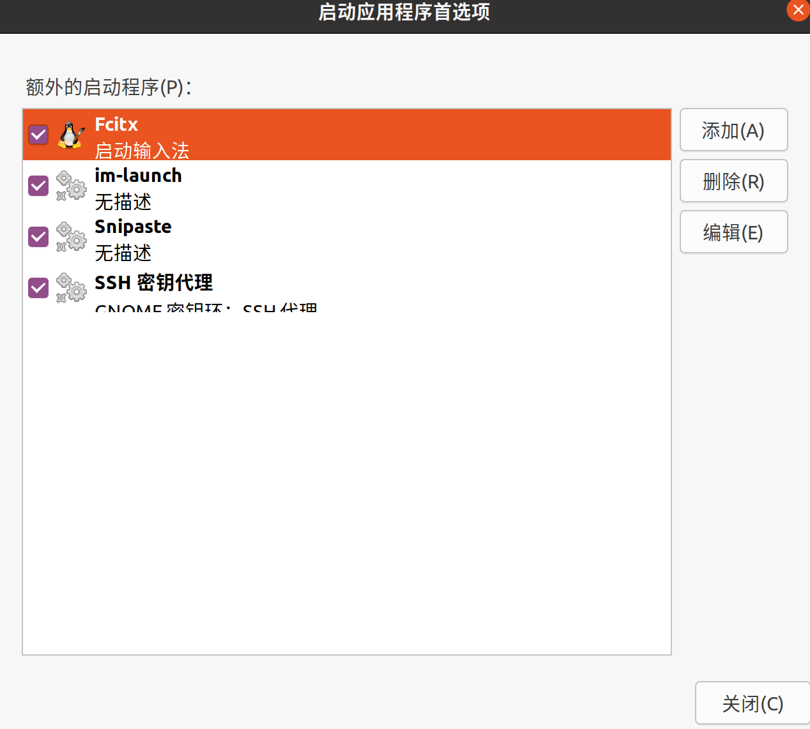
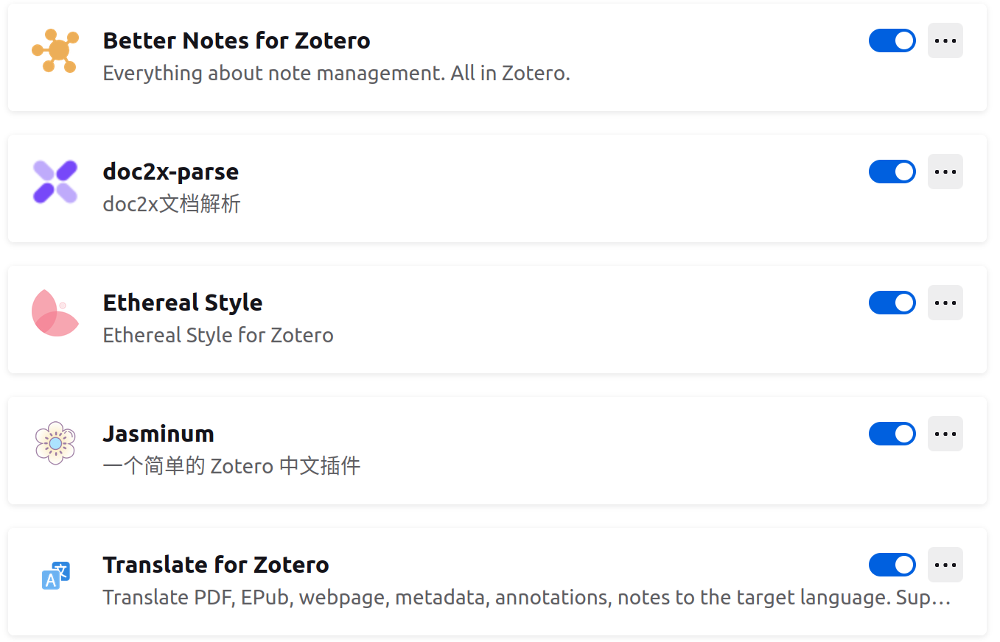
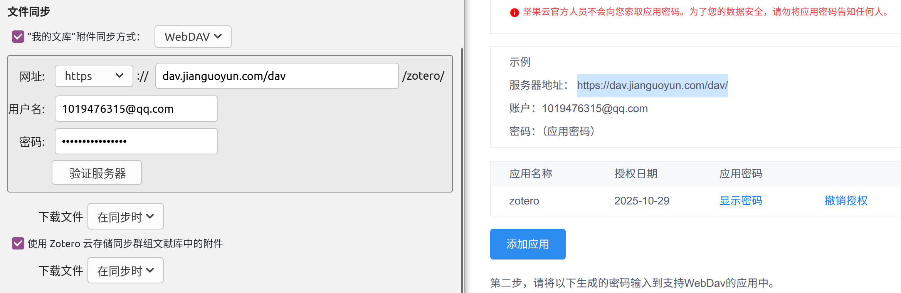

# Ubuntu20.04.6详细环境配置记录

安装谷歌浏览器、VS code、WPS、微信、安装中文输入法(建议搜狗拼音输入法)等步骤跳过

## 1.WPS安装后字体缺失问题解决

如果是双系统的话，从win里把字体包复制粘贴一份到linux即可：

首先打开有管理员权限的任务管理器

```
sudo nautilus
```

找到/Windows/Fonts文件夹，将其复制

然后再找到/usr/share/fonts，将刚复制的Fonts粘贴到里面，并重命名为windows-fonts（方便自己区分）

这样字体就会正常显示了

## 2.安装破解Typora1.9.3-1

参考链接：https://blog.csdn.net/weixin_65657501/article/details/142788747

在终端中输入如下命令：

    wget -qO - https://typoraio.cn/linux/public-key.asc | sudo tee /etc/apt/trusted.gpg.d/typora.asc
     
    sudo add-apt-repository 'deb https://typoraio.cn/linux ./'
     
    sudo apt-get update
     
    sudo apt-get install typora=1.9.3-1
激活：

```
git clone https://github.com/hazukieq/Yporaject.git
sudo apt install cargo
cd Yporaject/
cargo build
```

输出finished后：

```
ls target/debug
##看看结果有没有 node_inject
cargo run
sudo cp target/debug/node_inject /usr/share/typora
```

当前终端别关，**新开终端输入**：

```
cd /usr/share/typora/
sudo chmod 777 node_inject
sudo ./node_inject 
##下方将打印就对啦
extracting node_modules.asar
adding hook.js
applying patch
packing node_modules.asar
done!
##
```

返回**之前的终端**输入：

```
cd license-gen/
cargo build
cargo run
```

得到激活码结果如：<u>License for you: C2NNWT-RJG8DD-7N32LF-4L9YP8</u>

将其复制粘贴至激活框中，邮箱随便输入，符合规范即可，耐心等待

最后一步一直转圈，然后等待，等到跳出一个“用国内网络激活”，点一下就成功了

激活之后，Yporaject能删除

## 3.安装clash使用代理

Ubuntu20.04注意安装**1.7.6**版本！！！

仓库链接：https://github.com/clash-verge-rev/clash-verge-rev

下载后安装即可使用

```
sudo apt install ./clash-verge_1.7.6_amd64.deb
```

## 4.桌面美化

参考链接：https://blog.csdn.net/yaoyaohyl/article/details/119580622?ops_request_misc=&request_id=&biz_id=102&utm_term=dash%20to%20dock&utm_medium=distribute.pc_search_result.none-task-blog-2~all~sobaiduweb~default-6-119580622.142^v102^pc_search_result_base7&spm=1018.2226.3001.4187

效果：可以将底部任务栏居中

1.安装gnome-software和chrome-gnome-shell

```
//安装 gnome-software
sudo apt-get update
sudo apt-get upgrade
sudo apt-get install gnome-software
```

```
//安装Gnome-tweak-tool
sudo apt-get install -y gnome-tweak-tool
sudo apt-get install -y chrome-gnome-shell
sudo apt install -y gnome-shell-extensions
```

之后安装dash to dock（用谷歌浏览器）

装完一定要重启！！！

## 5.截图软件Snipaste安装

官网链接：https://zh.snipaste.com/

下载得到：Snipaste-2.10.8-x86_64.AppImage

先赋予权限：

```
chmod +x Snipaste-2.10.8-x86_64.AppImage
```

然后直接在终端中运行：

```bash
./Snipaste-2.10.8-x86_64.AppImage
```

使用F1即可截图

将软件移动到别的位置并添加开机自启动：

```
sudo mv Snipaste-2.10.8-x86_64.AppImage /opt
```

然后在启动应用程序中添加：



## 6.安装文献阅读工具Zotero

 参考链接：https://blog.csdn.net/xinjieyuan/article/details/105407564

首先官网下载压缩包：Zotero-7.0.27_linux-x86_64.tar.bz2

然后将其解压，解压后进入Zotero-7.0.27_linux-x86_64：

```
sudo mkdir /opt/zotero
sudo mv Zotero_linux-x86_64/* /opt/zotero/
cd /opt/zotero
sudo ./set_launcher_icon
```

创造软连接到应用程序桌面：

```
ln -s /opt/zotero/zotero.desktop ~/.local/share/applications/zotero.desktop
```

配置插件：

浏览器搜索zotero中文社区，并下载***\*Add-on Market for Zotero\****插件

然后安装如下插件（Linux下无法使用doc2x，建议win下翻译好后再阅读）：



Webdev同步文献，这样多设备就可以同步文件了：

注册一个坚果云账号，依次点击用户名、账户信息、安全选项、生成一个应用并在zotero中将同步设置如下：



设置好后点击验证服务器即可，之后zotero的文件就会自动同步到坚果云中
