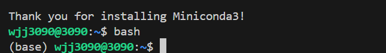
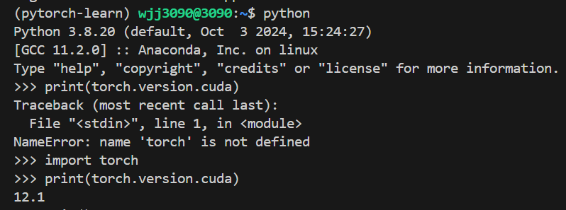
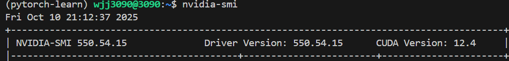
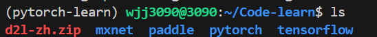
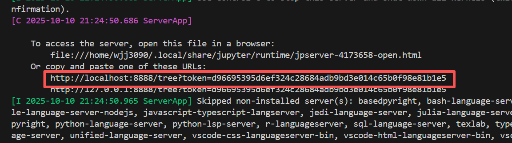
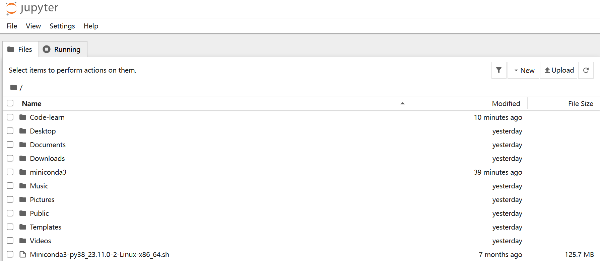

# 03 软件安装

## 1.安装miniconda和需要的软件包

```
sudo apt update
sudo apt install build-essential
sudo apt install python3.8
```

miniconda历史版本网址：https://repo.continuum.io/miniconda/

python3.8最新版的miniconda链接：https://repo.anaconda.com/miniconda/Miniconda3-py38_23.11.0-2-Linux-x86_64.sh

```
wget https://repo.anaconda.com/miniconda/Miniconda3-py38_23.11.0-2-Linux-x86_64.sh
```

使用bash安装，全部填yes

```
bash Miniconda3-py38_23.11.0-2-Linux-x86_64.sh
```

安装完成后输入bash即可进入conda环境：



接下来创建虚拟环境：

```
conda create -n pytorch-learn python=3.8
```

环境创建后，需要激活才能使用：

```bash
conda activate pytorch-learn
```

在虚拟环境中安装软件包（清华源）：

```
pip install jupyter d2l torch torchvision -i https://pypi.tuna.tsinghua.edu.cn/simple
```

安装完后可以确认torch的cuda与服务器cuda是否匹配：

1.进入python环境，查看torch的cuda版本：

```
import torch
print(torch.version.cuda)  # 输出 PyTorch 编译时对应的 CUDA 版本
```



2.查看服务器cuda版本：

```
nvidia-smi
```



**Jupyter记事本代码链接：**https://zh-v2.d2l.ai/d2l-zh.zip

下载Jupyter代码到服务器：

```
wget https://zh-v2.d2l.ai/d2l-zh.zip
```

之后解压文件并放到Code-learn文件夹中：

```
unzip d2l-zh.zip
```



服务器端启动jupyter：

```
jupyter notebook
```



ctrl+单击链接即可进入浏览器对当前目录下的代码进行编辑：



