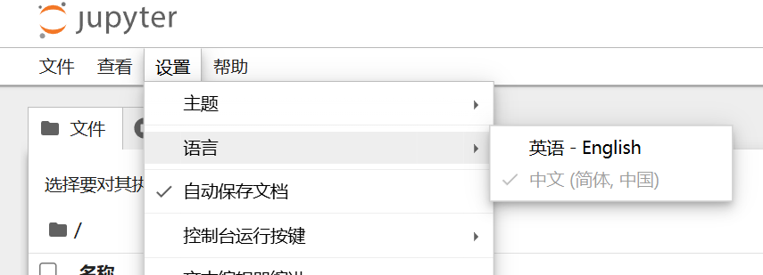
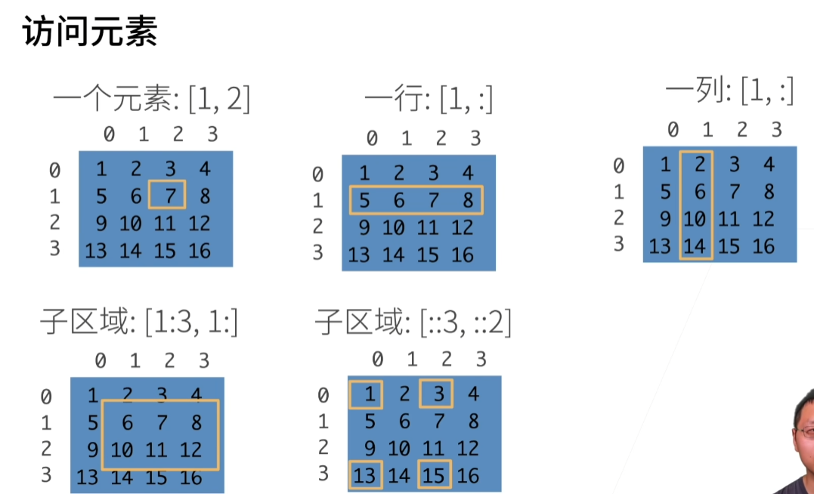

# 03 软件安装

## 1.安装miniconda和需要的软件包

```bash
sudo apt update
sudo apt install build-essential
sudo apt install python3.8
```

miniconda历史版本网址：https://repo.continuum.io/miniconda/

python3.8最新版的miniconda链接：https://repo.anaconda.com/miniconda/Miniconda3-py38_23.11.0-2-Linux-x86_64.sh

```bash
wget https://repo.anaconda.com/miniconda/Miniconda3-py38_23.11.0-2-Linux-x86_64.sh
```

使用bash安装，全部填yes

```bash
bash Miniconda3-py38_23.11.0-2-Linux-x86_64.sh
```

安装完成后输入bash即可进入conda环境：


接下来创建虚拟环境：

```bash
conda create -n pytorch-learn python=3.8
```

环境创建后，需要激活才能使用：

```bash
conda activate pytorch-learn
```

在虚拟环境中安装软件包（清华源）：

```bash
pip install jupyter d2l torch torchvision -i https://pypi.tuna.tsinghua.edu.cn/simple
```

安装完后可以确认torch的cuda与服务器cuda是否匹配：

1.进入python环境，查看torch的cuda版本：

```
import torch
print(torch.version.cuda)  # 输出 PyTorch 编译时对应的 CUDA 版本
```


2.查看服务器cuda版本：

```
nvidia-smi
```


**Jupyter记事本代码链接：**https://zh-v2.d2l.ai/d2l-zh.zip

下载Jupyter代码到服务器：

```
wget https://zh-v2.d2l.ai/d2l-zh.zip
```

之后解压文件并放到Code-learn文件夹中：

```
unzip d2l-zh.zip
```


服务器端启动jupyter：

```
jupyter notebook
```


ctrl+单击链接即可进入浏览器对当前目录下的代码进行编辑：


jupyter添加中文：

```
pip install jupyterlab-language-pack-zh-CN -i https://pypi.tuna.tsinghua.edu.cn/simple
```

添加后重启再次进入设置语言即可



# 04 数据操作+数据预处理



这张图展示了**多维数组（以二维数组为例，类似矩阵）的元素访问与切片规则**，常见于 Python 的 NumPy 库等支持数组切片的场景：

**1.访问 “一个元素”：`[1, 2]`**

- 含义：获取二维数组中**第 1 行、第 2 列**的元素（数组索引从 0 开始）。

**2.访问 “一行”：`[1, :]`**

- 含义：`:` 表示 “所有”，`[1, :]` 即获取**第 1 行的所有列元素**。

**3.访问 “一列”：`[:, 1]`**

- （注：图中写法标注为 `[1, :]` 可能是小笔误，逻辑应为 `[:, 1]`）含义：`[:, 1]` 表示 “所有行、第 1 列”，即获取**第 1 列的所有行元素**。

**4.访问 “子区域（连续行 + 所有列）”：`[1:3, 1:]`**

- 含义：
  - 行索引：`1:3` 表示 “从第 1 行到第 2 行（左闭右开，不包含索引 3）”；
  - 列索引：`1:` 表示 “从第 1 列到最后一列”。

**5.访问 “子区域（间隔行 + 间隔列）”：`[::3, ::2]`**

- 含义：
  - 行索引：`::3` 表示 “从第 0 行开始，每隔 3 行取一次”（即取第 0、3 行）；
  - 列索引：`::2` 表示 “从第 0 列开始，每隔 2 列取一次”（即取第 0、2 列）。


*数据操作文件：==<span style="color:#2ECC71">chapter_preliminaries/ndarray.ipynb</span>==*

## 一、张量（Tensor）基础

张量是深度学习中存储和操作数据的核心结构，本质是**n 维数组**，可对应不同数学概念：

- 1 维张量 → 向量（vector）
- 2 维张量 → 矩阵（matrix）
- 3 维及以上 → 无特殊数学名称（如`(2,3,4)`可表示 2 个 3 行 4 列的矩阵）

### 1. 核心特性（与 NumPy 对比）

| 特性     | PyTorch 张量                            | NumPy ndarray             |
| -------- | --------------------------------------- | ------------------------- |
| 计算设备 | 支持 CPU/GPU 加速                       | 仅支持 CPU                |
| 自动微分 | 支持（深度学习核心需求）                | 不支持                    |
| 内存共享 | 可与 NumPy 数组共享底层内存（高效转换） | 可与 PyTorch 张量共享内存 |

### 2. 张量创建方法

| 功能                 | 代码示例                              | 说明                                 |
| -------------------- | ------------------------------------- | ------------------------------------ |
| 连续整数张量         | `torch.arange(12)`                    | 创建 0~11 的 1 维张量，默认 int 类型 |
| 改变形状（不改变值） | `x.reshape(3,4)` 或 `x.reshape(-1,4)` | `-1`表示自动计算该维度长度           |
| 全 0 张量            | `torch.zeros((2,3,4))`                | 形状为 (2,3,4) 的三维全 0 张量       |
| 全 1 张量            | `torch.ones((2,3,4))`                 | 形状为 (2,3,4) 的三维全 1 张量       |
| 标准正态分布随机张量 | `torch.randn(3,4)`                    | 均值 0、标准差 1 的随机张量          |
| 自定义数值张量       | `torch.tensor([[2,1],[3,4]])`         | 从 Python 列表 / 嵌套列表创建张量    |

### 3. 张量基本属性

| 属性               | 代码示例    | 说明                                               |
| ------------------ | ----------- | -------------------------------------------------- |
| 形状（各维度长度） | `x.shape`   | 1 维张量`x`返回`torch.Size([12])`，2 维返回`(3,4)` |
| 元素总数           | `x.numel()` | 所有维度长度的乘积（如 3×4=12）                    |

## 二、张量运算

### 1. 按元素运算

对张量中**每个对应元素**执行标量运算，支持所有标准算术运算符：

- 二元运算：`+`、`-`、`*`、`/`、`**`（求幂）
- 一元运算：`torch.exp(x)`（对每个元素求指数）

```python
x = torch.tensor([1.0, 2, 4, 8])
y = torch.tensor([2, 2, 2, 2])
x + y  # 结果：tensor([3., 4., 6., 10.])
x ** y # 结果：tensor([1., 4., 16., 64.])
torch.exp(x) # 结果：tensor([2.7183, 7.3891, 54.5982, 2980.9580])
```

### 2. 张量连结（Concatenate）

将多个张量**端对端拼接**，需指定拼接维度（`dim`），要求非拼接维度形状一致：

| 拼接维度   | 代码示例                  | 说明                               |
| ---------- | ------------------------- | ---------------------------------- |
| 轴 0（行） | `torch.cat((X,Y), dim=0)` | 沿行方向拼接，行数相加（如 3+3=6） |
| 轴 1（列） | `torch.cat((X,Y), dim=1)` | 沿列方向拼接，列数相加（如 4+4=8） |

```python
X = torch.arange(12, dtype=torch.float32).reshape(3,4)
Y = torch.tensor([[2.0,1,4,3],[1,2,3,4],[4,3,2,1]])
torch.cat((X,Y), dim=0) # 输出形状：(6,4)
torch.cat((X,Y), dim=1) # 输出形状：(3,8)
```

### 3. 逻辑运算

通过逻辑条件生成**二元张量**（True→1，False→0）：

```python
X == Y  # 比较每个位置元素是否相等，输出形状与X/Y一致的张量
X < Y   # 比较每个位置元素是否X<Y，同理支持X>Y、X>=Y等
```

### 4. 张量求和

对张量中**所有元素求和**，生成单元素张量：

```python
X.sum()  # 输出：tensor(66.)（X为0~11的3×4矩阵，总和=0+1+...+11=66）
```

## 三、广播机制（Broadcasting）

当两个张量**形状不同**时，自动扩展张量至相同形状后执行按元素运算，核心规则：

1. 扩展仅针对**长度为 1 的维度**（不复制实际数据，仅逻辑扩展）；
2. 扩展后两个张量形状完全一致，再执行按元素操作。

**示例**：

```python
a = torch.arange(3).reshape((3,1))  # 形状(3,1)
b = torch.arange(2).reshape((1,2))  # 形状(1,2)
a + b  # 自动扩展为(3,2)后相加，结果：
# tensor([[0, 1],
#         [1, 2],
#         [2, 3]])
```

## 四、索引与切片

与 Python 列表操作一致，支持**读取 / 修改**张量元素：

| 操作             | 代码示例         | 说明                                     |
| ---------------- | ---------------- | ---------------------------------------- |
| 访问单个元素     | `X[1,2]`         | 访问第 2 行第 3 列元素（索引从 0 开始）  |
| 访问最后一个元素 | `X[-1]`          | 访问最后一行（1 维张量则为最后一个元素） |
| 访问连续行 / 列  | `X[1:3]`         | 访问第 2~3 行（左闭右开，不包含索引 3）  |
| 访问所有列 / 行  | `X[:, 2]`        | 访问所有行的第 3 列                      |
| 批量修改元素     | `X[0:2, :] = 12` | 将第 1~2 行所有列元素设为 12             |

## 五、内存优化（原地操作）

避免频繁分配新内存，尤其是大规模张量（如模型参数）：

### 1. 问题：普通运算的内存开销

```python
before = id(Y)
Y = Y + X  # 新分配内存，Y指向新地址
id(Y) == before  # 结果：False（地址已变）
```

### 2. 解决方案：原地操作

| 原地操作方式 | 代码示例                   | 说明                            |
| ------------ | -------------------------- | ------------------------------- |
| 切片赋值     | `Z[:] = X + Y`             | Z 预先分配内存，结果直接写入 Z  |
| 运算符简写   | `X += Y` 或 `X[:] = X + Y` | 不分配新内存，直接修改 X 的内容 |

```python
Z = torch.zeros_like(Y)  # 预先创建与Y同形状的全0张量
before = id(Z)
Z[:] = X + Y  # 原地写入，地址不变
id(Z) == before  # 结果：True

before = id(X)
X += Y  # 原地修改X
id(X) == before  # 结果：True
```

## 六、张量与其他对象转换

### 1. PyTorch 张量 ↔ NumPy 数组

- 共享底层内存，**修改一个会同步影响另一个**：

  ```python
  # 张量转NumPy数组
  A = X.numpy()
  type(A)  # 结果：numpy.ndarray
  
  # NumPy数组转张量
  B = torch.tensor(A)
  type(B)  # 结果：torch.Tensor
  ```

### 2. 单元素张量 ↔ Python 标量

适用于提取模型输出的标量结果（如损失值）：

```python
a = torch.tensor([3.5])
a.item()  # 结果：3.5（Python float类型）
float(a)  # 结果：3.5（同上）
int(a)    # 结果：3（转为整数）
```

## 七、核心小结

1. **张量是深度学习数据操作的核心**，支持 CPU/GPU 加速和自动微分；
2. 常用操作：创建（`arange`/`zeros`/`randn`）、形状修改（`reshape`）、按元素运算、连结（`cat`）、广播、索引切片；
3. 内存优化：优先使用原地操作（`+=`/`[:]`），避免频繁分配内存；
4. 数据转换：与 NumPy 数组高效互转，单元素张量可转为 Python 标量。

# 05线性代数

## 1.三大乘法运算：

| 对比维度     | 点积（Dot Product）                                          | 矩阵向量积（Matrix-Vector）      | 矩阵矩阵积（Matrix-Matrix）                        |
| ------------ | ------------------------------------------------------------ | -------------------------------- | -------------------------------------------------- |
| 运算对象     | 2 个一维向量（同维度）                                       | 1 个二维矩阵 + 1 个一维向量      | 2 个二维矩阵（前列 = 后行）                        |
| 输出形状     | 标量（0 维）                                                 | 一维向量（前矩阵行数维）         | 二维矩阵（前行 × 后列）                            |
| 核心逻辑     | 对应元素相乘求和                                             | 矩阵行 × 向量点积                | 前矩阵行 × 后矩阵列点积                            |
| PyTorch 接口 | `torch.dot(a, b)`                                            | `torch.mv(A, x)`                 | `torch.mm(A, B)`（二维）、`torch.matmul()`（高维） |
| 典型应用     | 余弦相似度、向量投影                                         | 单样本线性变换（如单张图像特征） | 批量线性变换（如批量图像、批量文本）               |
| 交换律       | 满足（\(\mathbf{a} \cdot \mathbf{b} = \mathbf{b} \cdot \mathbf{a}\)） | 不满足（矩阵与向量无法交换）     | 不满足（\(AB \neq BA\)）                           |

此外，还有**Hadamard积**（逐元素乘法），两个输入形状必须完全相同（如 \(m \times n\) 和 \(m \times n\)），数学符号\(A \circ B\) 或 \(A \odot B\)：

若 \(\mathbf{a} = [a_1, a_2, ..., a_n]\)，\(\mathbf{b} = [b_1, b_2, ..., b_n]\)，则：\(\mathbf{a} \circ \mathbf{b} = [a_1b_1, a_2b_2, ..., a_nb_n]\)

若 \(A = \begin{bmatrix} a_{11} & a_{12} \\ a_{21} & a_{22} \end{bmatrix}\)，\(B = \begin{bmatrix} b_{11} & b_{12} \\ b_{21} & b_{22} \end{bmatrix}\)，则：\(A \circ B = \begin{bmatrix} a_{11}b_{11} & a_{12}b_{12} \\ a_{21}b_{21} & a_{22}b_{22} \end{bmatrix}\)

## 2.范数

- **向量 L1 范数**：向量所有元素的绝对值之和

  \(\| \mathbf{x} \|_1 = \sum_{i=1}^{n} |x_i|\)

- **向量L2范数**：向量所有元素的平方和的平方根（欧几里得距离）

  \(\| \mathbf{x} \|_2 = \sqrt{\sum_{i=1}^{n} x_i^2}\)

- **F 范数**：矩阵所有元素的平方和的平方根（可视为矩阵的 L2 范数）

  \(\| A \|_F = \sqrt{\sum_{i=1}^{m} \sum_{j=1}^{n} A_{ij}^2}\)
