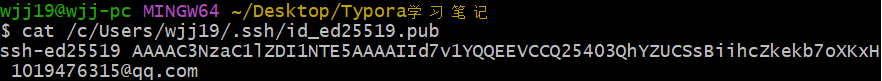
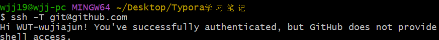

# 同步Typora笔记到Github中

## 1.生成SSH密钥

直接三次回车不设置密码

```
ssh-keygen -t ed25519 -C "1019476315@qq.com"
```

## 2.**将密钥添加到 ssh-agent**：

不设置密码这一步可以省略

```
# 启动ssh-agent
eval "$(ssh-agent -s)"

# 添加生成的私钥
ssh-add ~/.ssh/id_ed25519
```

## 3.**复制公钥内容**：

```bash
cat ~/.ssh/id_ed25519.pub
```

复制输出的全部内容



## 4.**添加到 GitHub 账户**：

- 登录 GitHub，点击右上角头像 → Settings

- 左侧菜单选择 SSH and GPG keys → New SSH key

- 在 "Title" 中输入一个标识（如 "Lenovo R7000"）

- 在 "Key" 中粘贴刚才复制的公钥内容

- 点击 "Add SSH key" 保存

## 5.**验证配置**：

  ```bash
  ssh -T git@github.com
  ```

  如果成功，会显示类似 "Hi 你的用户名！You've successfully authenticated..." 的信息

  完成后，再次尝试克隆仓库就应该能成功了。



## 6. 进入本地笔记文件夹

先通过`cd`命令进入「Typora 学习笔记」文件夹：

```bash
# 进入桌面（根据实际路径调整，Windows通常是~/Desktop）
cd ~/Desktop

# 进入目标文件夹
cd "Typora学习笔记"  # 文件夹名有空格，用引号包裹
```

## 7. 初始化 Git 仓库（若未初始化）

如果这个文件夹还不是 Git 仓库，需要初始化：

```bash
git init  # 初始化本地仓库，会生成隐藏的.git文件夹
```

## 8. 将文件添加到暂存区

```bash
git add .  # 添加当前文件夹下所有文件（包括子文件夹）
# 若只想添加特定文件，可替换为具体文件名，如 git add 笔记1.md
```

## 9. 提交文件到本地仓库

```bash
git commit -m "first commit"  # 引号内是提交说明，自定义即可
```

## 10. 关联 GitHub 远程仓库

将本地仓库与 GitHub 的 TyporaNote 仓库关联（只需执行一次）：

```bash
git remote add origin git@github.com:WUT-wujiajun/TyporaNote.git
```

- 若提示`fatal: remote origin already exists`，说明已关联过，可跳过此步。

## 11. 推送到 GitHub 仓库

视情况而定，主分支是main就用main，是master就用master

```bash
git push -u origin main  # 推送到远程仓库的main分支
```

- 若远程仓库有初始文件（如 README.md），可能需要先拉取再推送：

  ```bash
  git pull origin main --allow-unrelated-histories  # 拉取远程文件并合并
  git push -u origin main  # 再次推送
  ```
