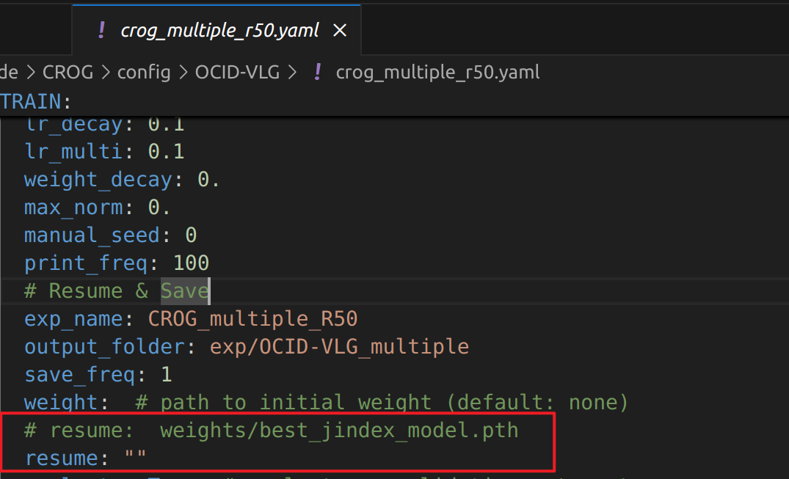
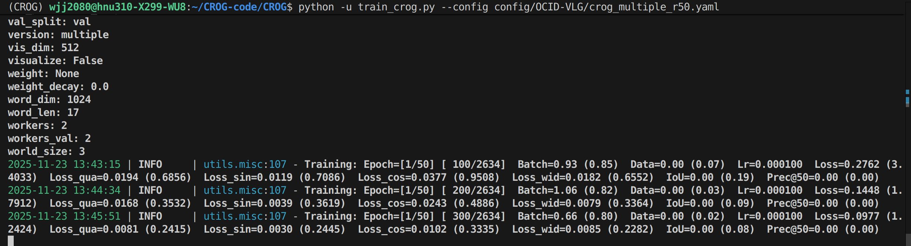
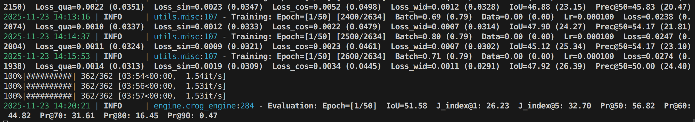
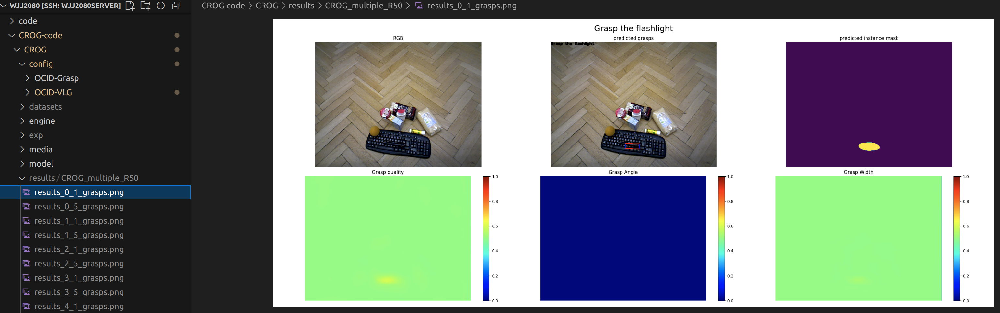
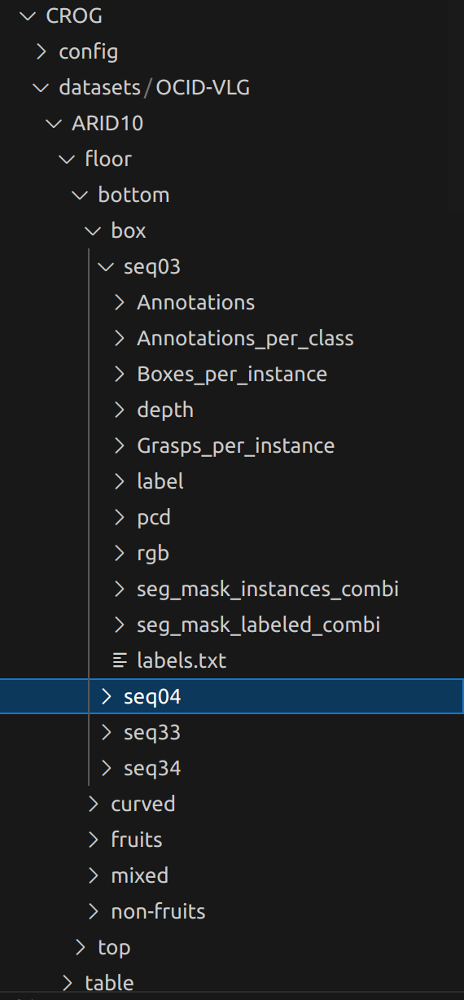
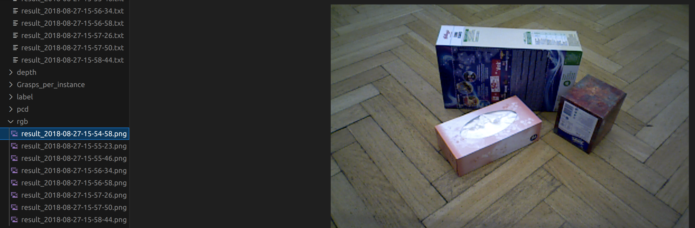
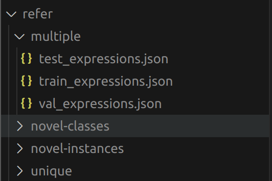

# 视觉-语言抓取网络

# CROG部分（2023）

模型仓库：https://github.com/HilbertXu/CROG

数据集仓库：https://github.com/gtziafas/OCID-VLG

## 1.新建环境:

```
conda create -n CROG python=3.8
```

然后把模型和数据集仓库都克隆

之后进入OCID-VLG目录执行：

```
pip install -r requirements.txt -i https://pypi.tuna.tsinghua.edu.cn/simple
pip install loguru PyYAML wandb lmdb pyarrow -i https://pypi.tuna.tsinghua.edu.cn/simple
```

requirements.txt内容如下(手动修改一下):

```
clip-openai

matplotlib==3.7.1

numpy==1.24.3

opencv_python==4.7.0.72

Pillow==9.5.0

segment_anything==1.0

Shapely==2.0.1

scikit-image

#torch==1.7.1
torch==1.10.1 

#torchvision==0.8.2
torchvision==0.11.2

tqdm==4.65.0
```

## 2.下载CLIP的预训练权重：

（需要在exp/下新建一个pretrain_clip文件夹）

```
wget https://openaipublic.azureedge.net/clip/models/afeb0e10f9e5a86da6080e35cf09123aca3b358a0c3e3b6c78a7b63bc04b6762/RN50.pt -O exp/pretrain_clip/RN50.pt
```

CROG下新建datasets文件夹，放入数据集文件夹OCID-VLG（不是仓库克隆下来的那个文件夹，而是谷歌云盘下载好的数据集并重命名为OCID-VLG）

修改crog_multiple_r50.yaml文件（防止第一次训练缺少权重文件报错）：



## 3.训练模型：

论文作者说两张4090大约需要跑3.5h（说的是35个epoch的情况下），实测3张2080ti训练1个epoch需要32min

```
python -u train_crog.py --config config/OCID-VLG/crog_multiple_r50.yaml
```






## 4.测试模型并可视化

有三个pth，随便选一个就可以

```
python -u test_crog.py --config config/OCID-VLG/crog_multiple_r50.yaml --opts resume exp/OCID-VLG_multiple/CROG_multiple_R50/best_iou_model.pth visualize True
```

生成的图像会被保存在results文件夹下



# ETRG部分（2025）

仓库地址https://github.com/hjy-u/ETRG-RGS

论文作者说代码改编自CROG和ETIRS，训练出来的模型ETRG（900M左右）比CROG（1.6G左右）小了整整一倍，此外**融入了深度图**，解决了CROG未使用深度图的问题

## 1.环境配置

直接用CROG创建的虚拟环境

```
git clone https://github.com/hjy-u/ETRG-RGS.git
```

## 2.下载CLIP的预训练权重：

（新建一个pretrain文件夹，这里和CROG不一样）

```
wget https://openaipublic.azureedge.net/clip/models/afeb0e10f9e5a86da6080e35cf09123aca3b358a0c3e3b6c78a7b63bc04b6762/RN50.pt -O pretrain/RN50.pt
```

## 3.训练模型：

```
python -u train.py --config config/OCID-VLG/etrg_r50.yaml
```

看这训练速度是比CROG还要慢，46.6min一个epoch！！！


# 数据集构成

## 1.ARID10/ARID20



| **文件名** | **内容描述**                | **格式与大小**                                               |
| ---------- | --------------------------- | ------------------------------------------------------------ |
| **rgb**    | **彩色图像**（RGB image）。 | 640×480 PNG 图像。                                           |
| **depth**  | **深度图像**（Depth Map）。 | 640×480 16-bit PNG 图像，深度值以毫米为单位。                |
| **pcd**    | **点云数据**。              | 640×480 组织化的 XYZRGBL 点云文件，包含地面真值 (ground truth)。 |

| **文件名**                   | **内容描述**                         | **格式与作用**                                               |
| ---------------------------- | ------------------------------------ | ------------------------------------------------------------ |
| **label**                    | **像素级物体唯一整数标签**。         | 640×480 16-bit PNG 图像，每个像素带有唯一的整数标签，用于识别每个单独的物体。 |
| **seg_mask_instances_combi** | **实例分割掩码**（Instance Masks）。 | 640×480 8-bit PNG 图像，包含组合后的、**类别无关**的实例掩码。 |
| **seg_mask_labeled_combi**   | **语义分割掩码**（Semantic Masks）。 | 640×480 8-bit PNG 图像，包含组合后的、使用**类别标签**的语义掩码。 |
| **labels.txt**               | 场景中物体**类别标签的序列**。       | 序列顺序定义了物体被添加到场景中的先后顺序。                 |

| **文件名**                | **内容描述**                     | **格式与作用**                                               |
| ------------------------- | -------------------------------- | ------------------------------------------------------------ |
| **Annotations**           | **手动标注的抓取候选**。         | .txt 文件，抓取候选以四个边界框角点坐标表示。                |
| **Annotations_per_class** | **分配给各物体类别的抓取候选**。 | 文件夹结构，每个文件夹包含分配给该物体类别的抓取候选列表（.txt 文件）。 |

### ARID20 结构（基于杂乱程度）

| **分类**   | **级别/字段**             | **含义**                                                     |
| ---------- | ------------------------- | ------------------------------------------------------------ |
| **位置**   | `location: floor, table`  | 场景位于**地面**还是**桌子**上。                             |
| **视角**   | `view: bottom, top`       | 摄像机安装在**下方**还是**上方**。                           |
| **杂乱度** | `free, touching, stacked` | 描述物体间的物理关系：**分离** (1-9 号物体)、**接触** (10-16 号物体)、**堆叠** (17-20 号物体)。 |

### ARID10 结构（基于物体类型）

| **分类**        | **级别/字段**                     | **含义**                                                     |
| --------------- | --------------------------------- | ------------------------------------------------------------ |
| **位置 & 视角** | `location, view`                  | 同 ARID20。                                                  |
| **物体类型**    | `box, curved, fruits, non-fruits` | **盒子**（尖锐边缘）、**曲线**（平滑表面）、**水果**、**非水果**。 |
| **混合**        | `mixed`                           | **盒子**和**曲线**物体的混合场景。                           |

**1.rgb：**存放不同时刻彩图（png格式）



**2.depth：**深度图（png格式），用于抓取预测，提供物体的几何信息。

**3.label：**像素级类别标签（png格式），记录每个像素属于哪个物体类别（如“杯子”、“盒子”）。

**4.labels.txt：**

格式形如：

```
7,17,17,7,7,17,11,27,27,7
```

**5.seg_mask_instances_combi：**实例分割掩码，区分场景中**每个单独的物体**

**6.seg_mask_labeled_combi：**语义分割掩码，区分物体**类别**

**7.Grasps_per_instance：**抓取位姿标注，存储场景中每个物体实例的**4-DoF 抓取矩形**标注信息 

**8.Boxes_per_instance：**实例边界框，存储场景中每个物体实例的 2D 边界框坐标

格式形如：

```
1;11;182 38 451 192
3;34;183 164 378 308
2;35;397 127 529 268
```

**9.Annotations / Annotations_per_class：**暂时没看懂是干嘛的

## 2.refer

存放四种类型的json文件



| **字段名称**                | **存储内容**                        | **含义与关联任务**                                           |
| --------------------------- | ----------------------------------- | ------------------------------------------------------------ |
| **"split"**                 | `"val"`                             | 该样本用于**验证集**（Validation Set）。                     |
| **"image_filename"**        | `"ARID10/.../seq22,..."`            | 场景图片的**存储路径和名称**。模型需要加载该图片进行处理。   |
| **"question"**              | `"Pick the red and white food bag"` | **自然语言指令**。这是模型需要理解的输入，用于定位和抓取物体（RGS 任务）。 |
| **"program"**               | `[...]`                             | **符号化程序**（Symbolic Program）。                         |
| **"answer"**                | `4`                                 | 程序的最终输出。通常是目标物体在场景图或物体列表中的**索引 ID**。 |
| **"target"**                | `"food\_bag\_3"`                    | 目标物体的**实例 ID**。用于在数据集中查找对应的分割掩码（Mask）或详细标注。 |
| **"template"**              | `"Pick the <C> <M> <Y>"`            | 用于生成该自然语言指令的**模板**结构。                       |
| **"concept_map"**           | `{...}`                             | **概念映射**。将模板中的符号（如 `<C>`）映射到具体的属性词（如 "red and white"）。 |
| **"box"**                   | `[381, 121, 113, 77]`               | **目标物体的 2D 边界框**（Bounding Box）。                   |
| **"grasps"**                | `[...]`                             | **抓取位姿标注列表**（Grasp Pose Annotations）。             |
| **"question_family_index"** | `0`                                 | 指令所属的**指令家族** ID。                                  |
| **"question_index"**        | `0`                                 | 指令在该家族中的**索引**。                                   |
| **"template_filename"**     | `"attribute.json"`                  | 指令模板文件来源，表明该指令是基于**属性**（如颜色）来指称物体的。 |

## 3.catalog.csv

存放ID	class	label	color	material	special

格式形如：

```
ID	class	label	color	material	special
1	apple	apple_1	red	organic	
2	apple	apple_2	green	organic	
3	ball	ball_1	blue	plastic	
4	ball	ball_2	yellow	plastic	rugby ball
5	ball	ball_3	red and white	plastic	polka ball,ball with spots,ball with dots
6	banana	banana_1	yellow	organic	
7	bell_pepper	bell_pepper_1	red	organic	
8	binder	binder_1	green	plastic	
```

## 4.OCID_sub_class_dict.py

这段 Python 代码是 **OCID-VLG 数据集**（或其衍生数据集）的**配置和映射文件**。它的主要作用是建立物体类别、具体实例、颜色和实验测试集之间的对应关系，是进行语义分割、实例分割和泛化能力测试的基础


# GraspSAM（ICRA 2025）

## 1.新建环境:

```bash
git clone https://github.com/gist-ailab/GraspSAM.git
cd GraspSAM

conda create -n GraspSAM python=3.8
conda activate GraspSAM

# pip install -r requirements.txt
pip install torch==2.0.1 torchvision==0.15.2 -i https://pypi.tuna.tsinghua.edu.cn/simple
```

