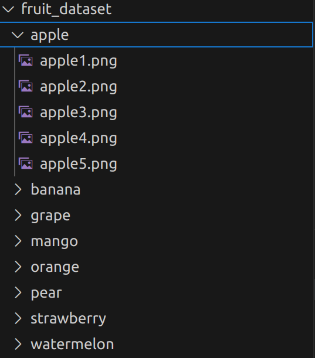
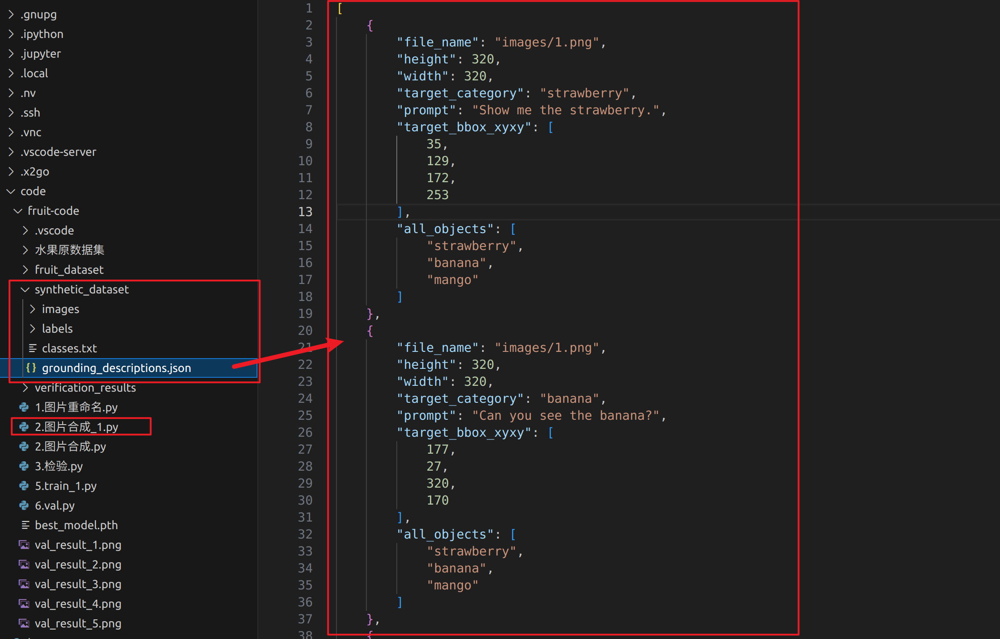
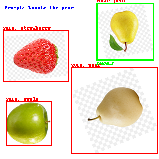
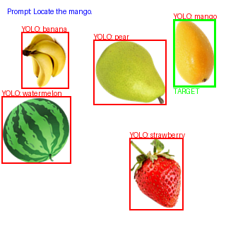
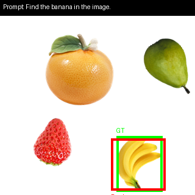
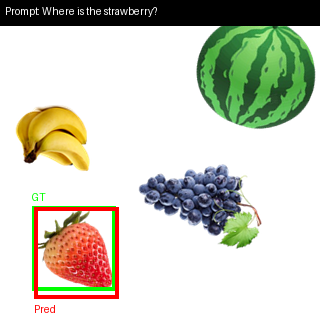

# 语言视觉定位构想

2025/11/21

```bash
# 设置 Hugging Face 镜像源（字节跳动镜像）
export HF_ENDPOINT=https://hf-mirror.com
```

## 1.准备数据集图片

准备8种水果的png图片（背景透明，脚本可以直接估算自动标注物体的框），比如：**苹果、香蕉、橘子、葡萄、草莓、梨、芒果、西瓜**

将这8种水果按照yolo格式编号为0-7，每种水果准备1-5张不同的图片，提高泛化性能



## 2.生成数据集

准备好图片后，接下来开始使用单个物体合成大图

**gemeni3.0提示词：**

​	**之后使用脚本在画幅为320*320的白板中随机放入4-6种水果，放入图片时随机旋转与缩放，并且尽量避免各个水果图片放入图片中产生重叠，一共生成50张图片，命名规则从1.png开始，生成图片过程中同步根据水果图片插入的位置生成yolo格式的位置标签，命名规则从1_label.txt开始，并且为每张图片生成一个描述信息（假如图片1中生成苹果、香蕉、橘子三种水果，则选择其中一种水果进行描述，生成的描述用于之后训练视觉-语言物体定位）**

------

为每张图的每一个物体都打上标签，并且生成对应的提示词，充分利用图片和文本资源，不至于一张图只能预测一个物体



## 3.验证生成的数据集

写一个脚本用来检验生成的标注框与文本的准确性：

下图就是指定一个梨的框，由于目前只区分不同的水果，所以出现两个梨的情况下，只会标注其中一个**（后续考虑优化）**



数据集优化：

1.把之前部分的假png通过https://www.remove.bg/zh/upload网站去除背景，生成无背景的图片，这样自动标注的框会更准确

2.由于当前代码存在一些问题，所以改成了一张图片中一种水果最多出现一次**（后续再优化）**



## 4.训练数据集

之后编写模型结构，并训练数据集，做到输入文本，模型预测输出检测框：

这是train_1.py与val_1.py的结果，训练了36轮就达到98%的准确率（iou>0.5的百分比），平均IOU达到 0.7328





之后打算一步步改进模型，包括提高数据集质量、添加物体的位置与颜色等更多信息用于物体定位（更多提示词）、保存的模型大小（目前达到472M大小）、训练速度等